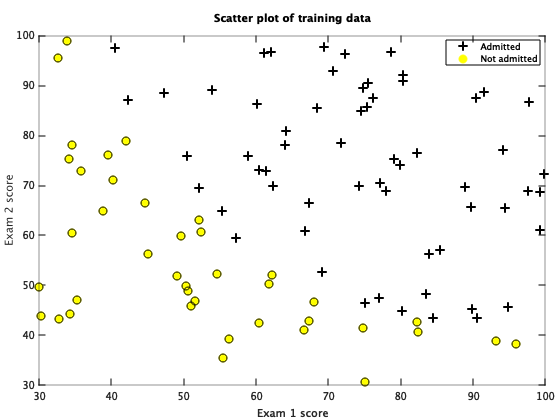
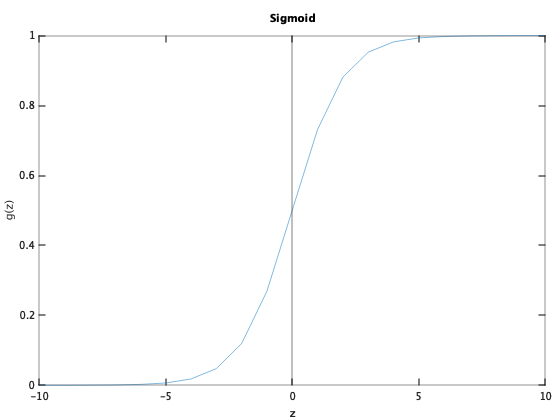
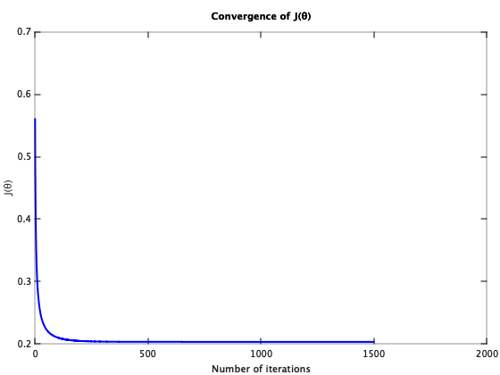
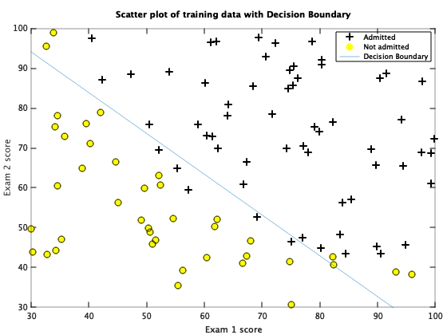

Supervised Learning - Classification - Logistic Regression (Octave)
====================================================================

Note: You can run below code in either Octave or Matlab.

Octave is a free software for mathematics and plotting. You can install Octave from [here](https://www.gnu.org/software/octave/).

Run following commands in Octave, and in the local path where all files are present in local Octave folder. 

`$ octave`

Once in Octave prompt, change the prompt to `>>>` using below command:

`PS1('>>>')`

# Load Data

## Initialization

Clear all variables 
`>>> clear`

Close all plot windows `>>> close all`

Clear command window/screen `>>> clc`

Load data 

`>>> data = load('data.txt')`

### Set X and y

In our test data first two columns contains the exam scores X, and the third column contains the label which will indicate if student will be admitted (y=1) or not admitted (y=0) into college based on the exam results in X.

Note: Octave is 1 index based so first column is index 1. 

`>>> X = data(:, [1, 2])`

`>>> y = data(:, 3)`

### Plot data calling plotData custom function

Plot to visualize the data. 

Plotting data with `+` indicating (y = 1) examples and `o` indicating (y = 0) examples.

`>>> plotData(X,y)`

Note: Octave prompt shoud be in the same path where custom functions (plotData or other custom function we are going to use below) are.

To check the current path run `pwd` in Octave prompt. You can use normal linux commands i.e. `ls` and `cd` to check / change paths. 

# Sigmoid / Logistic Function 

Sigmoid / Logistic function is defined as: 

logistic regression hypothesis is defined as:

h&theta;(x) = g(&theta;T x)

Where function g is the sigmoid function. 

Sigmoid is defiend as: 

Sigmoid help to keep hypothesis between 0 and 1 as 
0 &le; h&theta;(x) &le; 1

For large positive values of X, the sigmoid should be close to 1, while for large negative values, the sigmoid should be close to 0. Evaluating sigmoid(0) should give you exactly 0.5. 

Call sigmoid function:

`>>> sigmoid([0])  % will return 0.5`

`>>> sigmoid([1000])  % will return 1`

`>>> sigmoid([-1000])  % will return 0`

## Plotting sigmoid

Call custom function plotSigmoid to plot:

`>>> plotSigmoid()`

# Call cost function to calculate J(&theta;)

### Add 1 as first column to matrix 'X' for xo = 1 

`>>> X = [ones(length(data),1),data(:, [1, 2])]`

`>>> y = data(:, 3)`

### Set initial &theta; to zero (3x1 vector)

`>>> theta = zeros(3, 1)`

### Call cost function

`>>> [J, grad] = costFunction(theta, X, y)`

Expected value of cost J: `0.69315`

Expected value of gradient:  `-0.10000`, `-12.00922`, `-11.26284`

### Set &theta;o = -24, &theta;1 = 0.2, &theta;2 = 0.2 and call cost function again

`>>> theta = [-24; 0.2; 0.2]`

`>>> [J, grad] = costFunction(theta, X, y)`

Expected value of cost J: `0.21833`

Expected value of gradient:  `0.042903`, `2.566234`, `2.646797`

# Gradient descent 

## Feature Normalization/Scaling

Performing feature scaling can make gradient descent converge much more quickly.

### Initialize X and y

`>>> X = data(:, [1, 2])`

`>>> y = data(:, 3)`

### Call custom function featureNormalize:

`>>> [X mu sigma] = featureNormalize(X)`

## Perform Gradient descent on normalized features

Gradient descent is used to minimize cost function J(&theta;).

### Add 1 as first column to matrix 'X' for xo = 1 

`>>> X = [ones(length(X), 1) X]  %We are using normalized features here`

### Set initial &theta; to zero (3x1 vector)

`>>> initial_theta = zeros(3, 1)`

### Call Gradient descent function 
`>>> iterations = 1500`

`>>> alpha = 0.01`

`>>> [theta_gd, J_history] = gradientDescent(X, y, initial_theta, alpha, iterations)`

Cost function J(&theta;) will decrease and at the end of iterations will give constant same values. That will be the local minimum. 

This will give the parameters (value of &theta;) to be used for hypothesis h&theta;(x)
   

Expected value of &theta; is (&theta;o, &theta;1, &theta;2) = `(1.7183,  4.0127, 3.7437)`

# Plot the convergence graph

Find learning rates (&alpha;) that converges quickly. In our example we choose &alpha; = 0.01 with 1500 iterations. Graph below shows good convergence.

`>>> figure`

`>>> plot(1:numel(J_history), J_history, '-b', 'LineWidth', 2)`

`>>> xlabel('Number of iterations')`

`>>> ylabel('J(\theta)')`

`>>> title('Convergence of J(\theta)')`

# Advanced Optimization

Use of advanced optimization algorithms is another technique to optimize cost function instead of calling Gradient descent.

We are going to use fminunc to get the optimized values of &theta;

### Initialize X and y

`>>> X = data(:, [1, 2])`

`>>> y = data(:, 3)`

### Add 1 as first column to matrix 'X' for xo = 1 

`>>> X = [ones(length(data),1),data(:, [1, 2])]`

### Set options for fminunc

`>>> options = optimset('GradObj', 'on', 'MaxIter', 400)`

### Run fminunc to obtain the optimal theta

This function will return &theta; and the cost 

`>>> initial_theta = zeros(3, 1)`

`>>> [theta_ao, cost] = fminunc(@(t)(costFunction(t, X, y)), initial_theta, options)`

Expected value of cost: `0.20350`

Expected value of (&theta;0, &theta;1, &theta;2): (`-25.16127`, `0.20623`, `0.20147`)

## Plot Decision Boundary

### Call custom function plotDecisionBoundary

`>>> plotDecisionBoundary(theta_ao, X, y)`

`>>> hold on`

`title('Scatter plot of training data with Decision Boundary')`

# Prediction
Using calculated h&theta;(x)

h&theta;(x) = g(&theta;T x)

Where function g is the sigmoid function. 

Sigmoid is defiend as: 

h&theta;(x) = &theta;oxo  + &theta;1x1

In vectorization form: 

h&theta;(x) = X * &theta;

Predict the probability that a student with score 45 on exam 1 and score 85 on exam 2 will be admitted.

Furthermore, we will compute the training and test set accuracies of our model.

### Calling using Grdient Descent &theta; parameters

`>>> prob_gd = sigmoid([1 45 85] * theta_gd)`

Expected value: Admission probability of `1` for a student with scores 45 and 85

### Calling using Advanced Optimization `fminunc` &theta; parameters

`>>> prob_ao = sigmoid([1 45 85] * theta_ao)`

Expected value: Admission probability of `0.77629` for a student with scores 45 and 85

## Calling using predict custom function which will call sigmoid function and round off the result to get either 0 or 1:

### Calling using Grdient Descent &theta; parameters

`>>> prob_gd = predict(theta_gd,[1 45 85])`

Expected value: Admission probability of `1` for a student with scores 45 and 85

### Calling using Advanced Optimization `fminunc` &theta; parameters

`>>> prob_ao = predict(theta_ao,[1 45 85])`

Expected value: Admission probability of `1` for a student with scores 45 and 85

## Compute accuracy on our training set:

### Calling using Grdient Descent &theta; parameters

`>>> p_gd = predict(theta_gd, X)`

`>>> fprintf('Train Accuracy: %f\n', mean(double(p_gd == y)) * 100)`

Expected value: `89.0`

### Calling using Advanced Optimization `fminunc` &theta; parameters

`>>> p_ao = predict(theta_ao, X)`

`>>> fprintf('Train Accuracy: %f\n', mean(double(p_ao == y)) * 100)`

Expected value: `89.0`
