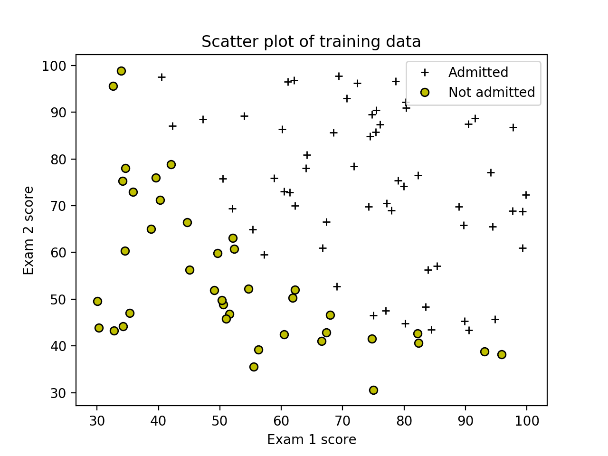
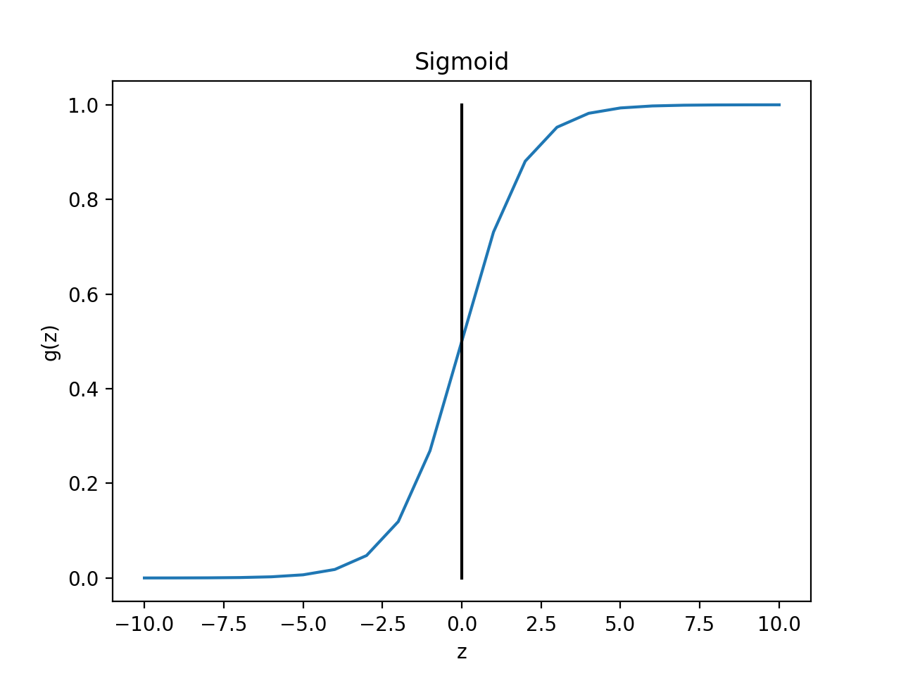
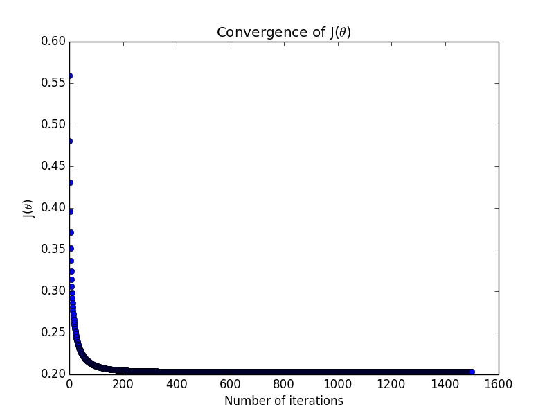

Supervised Learning - Classification - Logistic Regression (Python)
====================================================================

Run following commands in Python3, and in the local path where all files are present in local Python folder. 

You need to install [Matplotlib](https://matplotlib.org/index.html) which we are using for plotting the data. 

To [install](https://matplotlib.org/users/installing.html) Matplotlib on Mac run following command: 

`$ python3 -m pip install -U matplotlib`

# Load Data

Module `loadData.py` will be used to load data. We will use this module in other python files. 

In our test data first two columns contains the exam scores X, and the third column contains the label which will indicate if student will be admitted (y=1) or not admitted (y=0) into college based on the exam results in X.

Note: Python is 0 index based so first column is index 0. 

### Plot data calling plotData custom function

Plot to visualize the data. 

Plotting data with `+` indicating (y = 1) examples and `o` indicating (y = 0) examples.

Run plotData.py from command prompt:

`$ python3 plotData.py`

# Sigmoid / Logistic Function 

Sigmoid / Logistic function is defined as: 

h&theta;(x) = g(&theta;T x)

Where function g is the sigmoid function. 

Sigmoid is defiend as: 

Sigmoid help to keep hypothesis between 0 and 1 as 
0 &le; h&theta;(x) &le; 1

For large positive values of X, the sigmoid should be close to 1, while for large negative values, the sigmoid should be close to 0. Evaluating sigmoid(0) should give you exactly 0.5. 

Run sigmoid.py from command prompt:

`$ python3 sigmoid.py`

Script will call the sigmoid function which will do following:
* Call sigmoid function with `z = 0`. Expected value `0.5`
* Call sigmoid function with `z = 1000`. Expected value `1`
* Call sigmoid function with `z = -1000`. Expected value `0`

## Plotting sigmoid

Run plotSigmoid.py from command prompt:

`$ python3 plotSigmoid.py`

# Call cost function to calculate J(&theta;)

Run computeCost.py from command prompt: 

`$ python3 computeCost.py`

Script will call the computeCost function with following values:
* (&theta;o, &theta;1, &theta;2) =  `(0,0,0)` 
* (&theta;o, &theta;1, &theta;2) = `(-24,0.2,0.2)`. 

Function will add 1 as first column to X for xo = 1.

Expected values for `(0,0,0)`:
* Value of J: `0.69314718`
* Value of gradient:  `-0.10000`, `-12.00921659`, `-11.26284221`

Expected values for `(-24,0.2,0.2)`:
* Value of J: `0.21833019`
* Value of gradient:  `0.04290299`, `2.56623412`, `2.64679737`

# Train Model - Gradient descent 

We will use Gradient descent to minimize cost function J(&theta;) and use it to train our model.

Gradient descent is used to minimize cost function J(&theta;). 

Cost function J(&theta;) will decrease and at the end of iterations will give constant same values. That will be the local minimum. 

This will give the parameters (value of &theta;) to be used for hypothesis h&theta;(x).

Note: For large data set, we train model once and save the parameters &theta; We use these saved parameters later for prediction. 

Run gradientDescent.py from command prompt: 

`$ python3 gradientDescent.py`

Script will call the gradientDescent function with following values:

* (&theta;o, &theta;1, &theta;2) =  `(0,0,0)`  
* iterations = `1500`
* &alpha; = `0.01`

Function will first normalize X and then add 1 as first column to normalized X for xo = 1.

Expected value of &theta; is (&theta;o, &theta;1, &theta;2) = `(1.71835438, 3.99258451, 3.72493998)`

# Plot the convergence graph

Find learning rates (&alpha;) that converges quickly. In our example we choose &alpha; = 0.01 with 1500 iterations. Graph below shows good convergence.

Run plotConvergence.py from command prompt:

`$ python3 plotConvergence.py`

Script will call the plotConvergence function which will do following:
* Normalize X  
* Function will add 1 as first column to normalized X for xo = 1.
* Call gradientDescent function from gradientDescent.py module to return J_history 
* Plot J(&theta;) against Number of iterations (`1500`)

# Advanced Optimization

Use of advanced optimization algorithms is another technique to optimize cost function instead of calling Gradient descent. We will use this technique and use `minimize` function of `scipy` library to train our model to get tained values of values of &theta;

Note: For large data set, we train model once and save the parameters &theta; We use these saved parameters later for prediction. 

Run optimizeTheta.py from command prompt:

`$ python3 optimizeTheta.py`

Script will call the optimizeTheta function which will do following:
* Call `minimize` of `scipy` library and pass costFunction to calculate cost 
* Return trained parameters &theta;

Expected value of cost: `0.2034977`

Expected value of (&theta;0, &theta;1, &theta;2): (`-25.16131854`, `0.20623159`, `0.20147149`)

## Plot Decision Boundary

Run plotDecisionBoundary.py from command prompt:

`$ python3 plotDecisionBoundary.py`

Script will call the plotDecisionBoundary function which will do following:
* Call optimizeTheta in optimizeTheta.py module to get the optimized value of &theta;
* Plot Decision Boundary

# Prediction
We will use the parameter &theta; we trained earlier. We wil apply &theta; to the following model to calculate h&theta;(x) which will be the predicted value for new data set.

h&theta;(x) = g(&theta;T x)

Where function g is the sigmoid function. 

Sigmoid is defiend as: 

h&theta;(x) = &theta;oxo  + &theta;1x1

In vectorization form: 

h&theta;(x) = X * &theta;

Predict the probability that a student with score 45 on exam 1 and score 85 on exam 2 will be admitted.

Furthermore, we will compute the training and test set accuracies of our model.

### Calling using Grdient Descent trained &theta; parameters

Run predictBasedOnGradientDescent.py from command prompt: 

`$ python3 predictBasedOnGradientDescent.py`

Expected value: Admission probability of `1` for a student with scores 45 and 85

### Calling using Advanced Optimization trained &theta; parameters

Run predictBasedOnAdvancedOptmization.py from command prompt: 

`$ python3 predictBasedOnAdvancedOptmization.py`

Expected value: Admission probability of `0.77629062` for a student with scores 45 and 85

# Compute accuracy on our training set

Run computeAccuracy.py from command prompt:

`$ python3 computeAccuracy.py`

Script will call the computeAccuracy function which will do following:
* Call optimizeTheta in optimizeTheta.py module to train model and get trained values of &theta;
* Predict value and compute accuracy

Expected value: `89.0`
