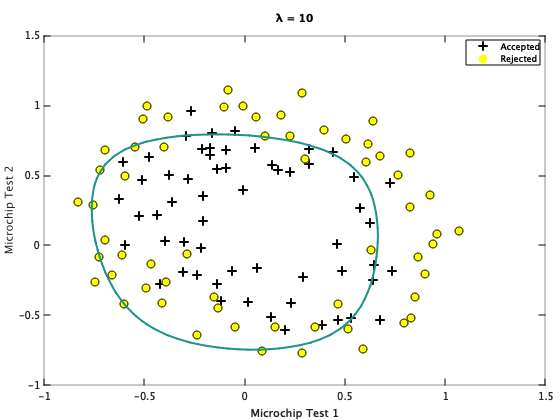

Supervised Learning - Classification - Regularized Logistic Regression (Octave)
================================================================================

We are going to implment the Logistic Regression algorithm using Regularization technique. Regularization technique addresses the problem of overfitting or underfitting training data over the descision boudntry. 

Regularization can also be used with Linear Regression.

Note: You can run below code in either Octave or Matlab.

Octave is a free software for mathematics and plotting. You can install Octave from [here](https://www.gnu.org/software/octave/).

Run following commands in Octave, and in the local path where all files are present in local Octave folder. 

`$ octave`

Once in Octave prompt, change the prompt to `>>>` using below command:

`PS1('>>>')`

# Load Data

## Initialization

Clear all variables 
`>>> clear`

Close all plot windows `>>> close all`

Clear command window/screen `>>> clc`

Load data 

`>>> data = load('data.txt')`

### Set X and y

In our training data first two columns contains microchip tests on two different tests (X). From these two tests, you would like to determine whether the microchips should be accepted or rejected (y).

Note: Octave is 1 index based so first column is index 1. 

`>>> X = data(:, [1, 2])`

`>>> y = data(:, 3)`

### Plot data calling plotData custom function

Plot to visualize the data. 

Plotting data with `+` indicating (y = 1) examples and `o` indicating (y = 0) examples.

`>>> plotData(X,y)`

Note: Octave prompt shoud be in the same path where custom functions (plotData or other custom function we are going to use below) are.

To check the current path run `pwd` in Octave prompt. You can use normal linux commands i.e. `ls` and `cd` to check / change paths. 

# Feature Mapping

Looking at the plot, we need to fit data into higher degress of Polynomial Features to get better result. 

We will map the features into all polynomial terms of x1 and x2 up to the sixth power.

### Call custom function mapFeature 

`>>> X = mapFeature(X(:,1), X(:,2))`

As a result of this mapping, our vector of two features (the scores on two QA tests) has been transformed into a 28-dimensional vector. 

A logistic regression classifier trained on this higher-dimension feature vector will have a more complex decision boundary and will appear nonlinear when drawn in our 2-dimensional plot.

While the feature mapping allows us to build a more expressive classifier, it also more susceptible to overfitting. We will implement regularized logistic regression to fit the data and also see how regularization can help combat the overfitting problem.

# Call Regularized cost function to calculate J(&theta;)

### Set initial &theta; to zero

`>>> theta = zeros(size(X, 2), 1)`

### Set regularization parameter &lambda; to 1

`>>> lambda = 1`

### Call Regularized cost function

`>>> [J, grad] = costFunctionReg(theta, X, y, lambda)`

Expected value of cost J: `0.69315`

Expected value of first 5 gradient:  `0.008474576`, `0.018788093`, `0.000077771`, `0.050344640`, `0.011501331`

 
### Set initial &theta; to zero

`>>> theta = ones(size(X,2),1)`

### Set regularization parameter &lambda; to 10

`>>> lambda = 10`

### Call Regularized cost function

`>>> [J, grad] = costFunctionReg(theta, X, y, lambda)`

Expected value of cost J: `3.1645`

Expected value of first 5 gradient:  `0.346045`, `0.161352`, `0.194796`, `0.226863`, `0.092186`

# Regularization and Accuracies 

We will try different values of &lambda; and see how regularization affects the decision coundart

We will try the following values of &lambda; (0, 1, 10, 100).

## With &lambda; = 0 (Overfitting)

Call custom function regularizeAndPlotData

`>>> theta = regularizeAndPlotData(X, y, 0)`

## With &lambda; = 1 (Best fitting)

Call custom function regularizeAndPlotData

`>>> theta = regularizeAndPlotData(X, y, 1)`

## With &lambda; = 10 (Underfitting)

Call custom function regularizeAndPlotData

`>>> theta = regularizeAndPlotData(X, y, 10)`

## With &lambda; = 100 (Underfitting)

Call custom function regularizeAndPlotData

`>>> theta = regularizeAndPlotData(X, y, 100)`

# Prediction
Using calculated h&theta;(x)

h&theta;(x) = g(&theta;T x)

Where function g is the sigmoid function. 

Sigmoid is defiend as: 

h&theta;(x) = &theta;oxo  + &theta;1x1

In vectorization form: 

h&theta;(x) = X * &theta;

Predict the probability that microchip test 0.5 and 0.3 will be Accepted.

Plot for &lambda; = 1 seems best fit so we will use &theta; values of this &lambda; value. 

Map the features into all polynomial terms of x1 and x2 up to the sixth power.

`>>> predict_X = mapFeature(0.5, 0.3)`

`>>> prob = sigmoid(predict_X * theta)`

Expected value: Accepted probability of `0.72698` for a microchip test 0.5 and 0.3 

## Calling using predict custom function which will call sigmoid function and round off the result to get either 0 or 1:

`>>> prob = predict(theta, predict_X)`

Expected value: Accepted probability of `1` for a microchip test 0.5 and 0.3 

# Compute accuracy on our training set

Plot for &lambda; = 1 seems best fit so we will use &theta; values of this &lambda; value. 

`>>> p = predict(theta, X)`

`>>> fprintf('Train Accuracy: %f\n', mean(double(p == y)) * 100)`

Expected value with &lambda; = 1: `83.050847`