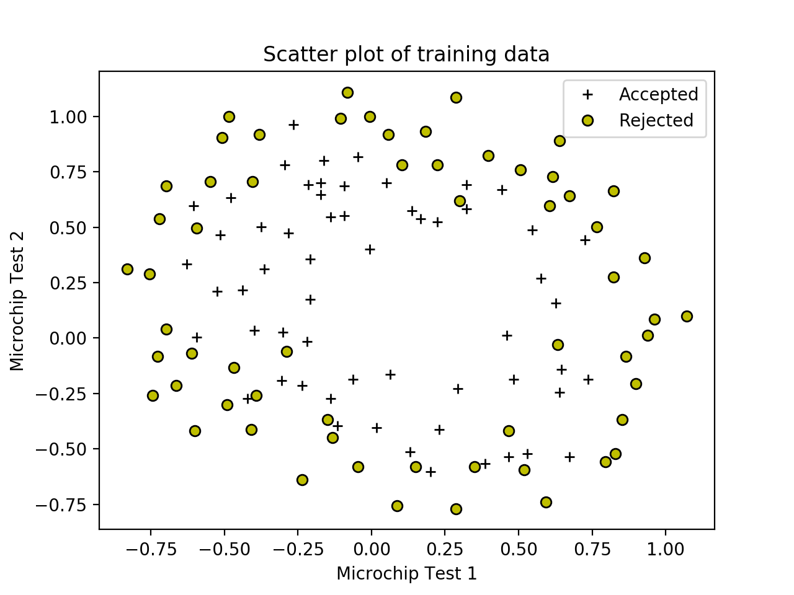
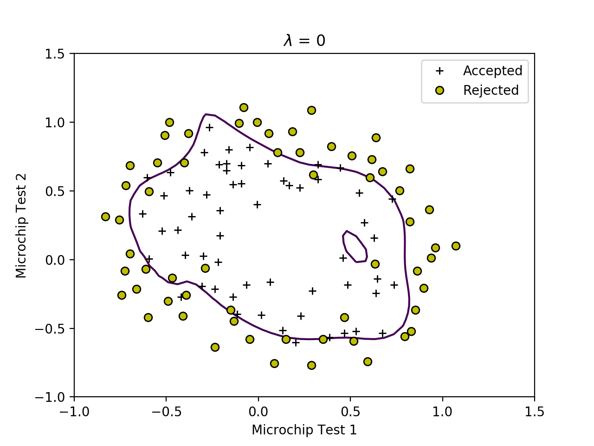
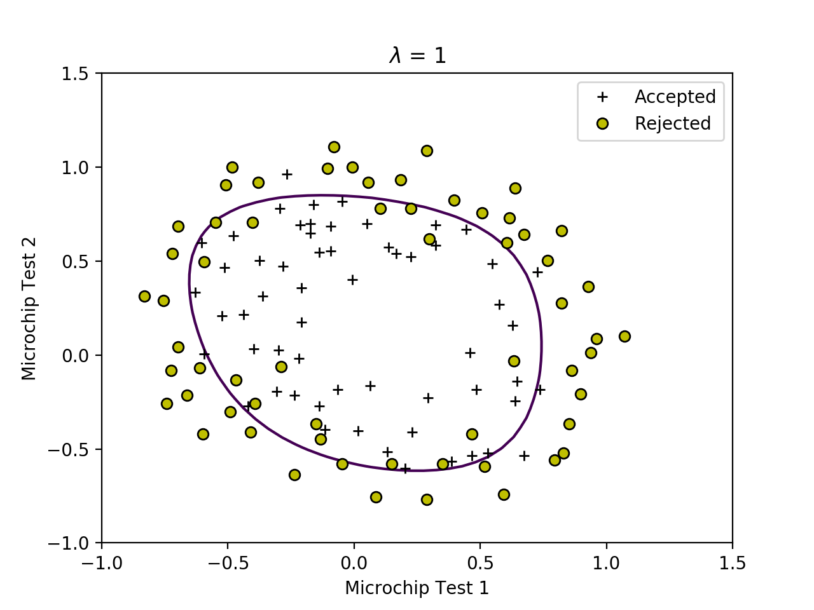
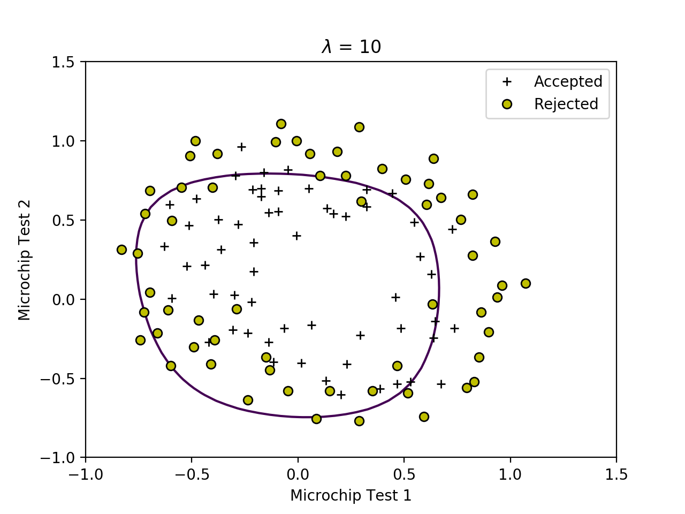
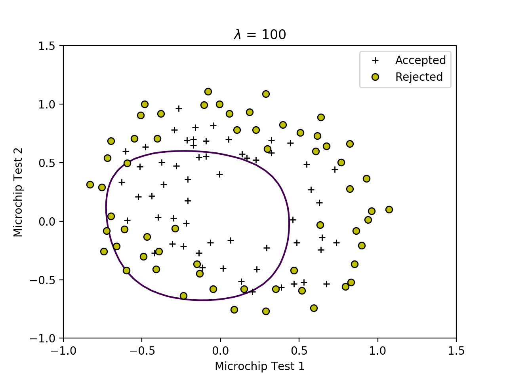

Supervised Learning - Classification - Regularized Logistic Regression (Python)
================================================================================

We are going to implment the Logistic Regression algorithm using Regularization technique. Regularization technique addresses the problem of overfitting or underfitting training data over the descision boudntry. 

Regularization can also be used with Linear Regression.

Run following commands in Python3, and in the local path where all files are present in local Python folder. 

You need to install [Matplotlib](https://matplotlib.org/index.html) which we are using for plotting the data. 

To [install](https://matplotlib.org/users/installing.html) Matplotlib on Mac run following command: 

`$ python3 -m pip install -U matplotlib`

# Load Data

Module `loadData.py` will be used to load data. We will use this module in other python files. 

In our training data first two columns contains microchip tests on two different tests (X). From these two tests, you would like to determine whether the microchips should be accepted or rejected (y).

Note: Python is 0 index based so first column is index 0. 

### Plot data calling plotData custom function

Plot to visualize the data. 

Plotting data with `+` indicating (y = 1) examples and `o` indicating (y = 0) examples.

Run plotData.py from command prompt:

`$ python3 plotData.py`

# Feature Mapping

Looking at the plot, we need to fit data into higher degress of Polynomial Features to get better result. 

We will map the features into all polynomial terms of x1 and x2 up to the sixth power.

###  Custom function mapFeature 

Module `mapFeature.py` will be used to map features. We will use this module in other python files. 

As a result of this mapping, our vector of two features (the scores on two QA tests) has been transformed into a 28-dimensional vector. 

A logistic regression classifier trained on this higher-dimension feature vector will have a more complex decision boundary and will appear nonlinear when drawn in our 2-dimensional plot.

While the feature mapping allows us to build a more expressive classifier, it also more susceptible to overfitting. We will implement regularized logistic regression to fit the data and also see how regularization can help combat the overfitting problem.

# Call Regularized cost function to calculate J(&theta;)

Run costFunctionReg.py from command prompt:

`$ python3 costFunctionReg.py`

Script will call the costFunctionReg function which will do following:
* Call `mapFeature` function in `mapFeature.py` module to map feature to 6 degree polynomial
* Calculate cost for &lambda; values `1` and `10`
* Expected values `0.69314718`, `3.16450933`

# Train Model - Advanced Optimization

Use of advanced optimization algorithms is another technique to optimize cost function instead of calling Gradient descent. We will use this technique and use `minimize` function of `scipy` library to train our model to get tained values of values of &theta;

Note: For large data set, we train model once and save the parameters &theta;. We then use these saved parameters later for prediction. 

Run optimizeTheta.py from command prompt:

`$ python3 optimizeTheta.py`

Script will call the optimizeTheta function which will do following:
* Call `minimize` of `scipy` library and pass costFunctionReg to calculate cost for &lambda; = 1 
* * Return trained parameters &theta;

Expected value of cost: `0.52900273`

# Regularization and Accuracies 

We will try different values of &lambda; and see how regularization affects the decision coundart

We will try the following values of &lambda; (0, 1, 10, 100).

Run plotDecisionBoundary.py from command prompt:

`$ python3 plotDecisionBoundary.py`

Script will call the plotDecisionBoundary function which will do following:
* Call `mapFeature` in `mapFeature.py` module to map features 
* Call `optimizeTheta` in `optimizeTheta.py` module to get optimized values of &theta;
* Plot Decision Boundary

## With &lambda; = 0 (Overfitting)

## With &lambda; = 1 (Best fitting)

## With &lambda; = 10 (Underfitting)

## With &lambda; = 100 (Underfitting)

# Prediction

We will use the parameter &theta; we trained earlier. We wil apply &theta; to the following model to calculate h&theta;(x) which will be the predicted value for new data set.

h&theta;(x) = g(&theta;T x)

Where function g is the sigmoid function. 

Sigmoid is defiend as: 

h&theta;(x) = &theta;oxo  + &theta;1x1

In vectorization form: 

h&theta;(x) = X * &theta;

Predict the probability that microchip test 0.5 and 0.3 will be Accepted.

Plot for &lambda; = 1 seems best fit so we will use trained &theta; values of this &lambda; value. 

Map the features into all polynomial terms of x1 and x2 up to the sixth power.

Run predict.py from command prompt:

`$ python3 predict.py`

Script will call the predict function which will do following:
* Call `mapFeature` in `mapFeature.py` module to map features `0.5` and `0.3`
* Call `optimizeTheta` in `optimizeTheta.py` module to train model and get trained values of  &theta; for &lambda; = 1
* Call `sigmoid` in `sigmoid.py` to predict value

Expected value: Accepted probability of `0.72710959` for a microchip test 0.5 and 0.3 

# Compute accuracy on our training set

Plot for &lambda; = 1 seems best fit so we will use trained &theta; values of this &lambda; value. 

Run computeAccuracy.py from command prompt:

`$ python3 computeAccuracy.py`

Script will call the computeAccuracy function which will do following:
* Call `mapFeature` in `mapFeature.py` module to map features X in training example 
* Call `optimizeTheta` in `optimizeTheta.py` module to train model and get trained values of  &theta; for &lambda; = 1
* Call `sigmoid` in `sigmoid.py` to predict value
* Compute accuracy

Expected value with &lambda; = 1: `83.05084745762711`