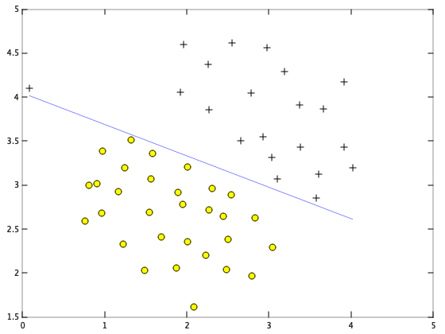

Supervised Learning - Classification - Support Vector Machines (Octave)
========================================================================

Note: You can run below code in either Octave or Matlab.

Octave is a free software for mathematics and plotting. You can install Octave from [here](https://www.gnu.org/software/octave/).

Run following commands in Octave, and in the local path where all files are present in local Octave folder. 

`$ octave`

Once in Octave prompt, change the prompt to `>>>` using below command:

`PS1('>>>')`

## Initialization

Clear all variables 
`>>> clear`

Close all plot windows `>>> close all`

Clear command window/screen `>>> clc`

# Goal
In the first part, we will use Support Vector Machines (SVMs) with various example 2D datasets. Experimenting with these datasets will help us gain an intuition of how SVMs work and how to use a Gaussian kernel with SVMs. 

In the next part, we will use Support Vector Machines to build a spam classifier.

Support Vector Machines (SVMs) Intuition
=========================================

## Goal

In this part, we will begin by with a 2D example dataset which can be separated by a linear boundary. We will plot the training data. In this dataset, the positions of the positive examples (indicated with +) and the negative examples (indicated with o) suggest a natural separation indicated by the gap. However, notice that there is an outlier positive example + on the far left at about (0.1, 4.1).We will also see how this outlier affects the SVM decision boundary.

We will try using different values of the C parameter with SVMs. Informally, the C parameter is a positive value that controls the penalty for misclassified training examples. A large C parameter tells the SVM to try to classify all the examples correctly. C plays a role similar to 1/&lambda; , where &lambda; is the regularization parameter that we were using previously for logistic regression.

## Working with Data Set 1 (linear)

### Load Data Set 1 

`>>> load('ex6data1.mat');`

This will set X and y variables.

### Visualize Data Set 1

Plot to visualize the data. 

Plotting data with `+` indicating (y = 1) examples and `o` indicating (y = 0) examples.

`>>> plotData(X,y);`

Note: Octave prompt shoud be in the same path where custom functions (plotData or other custom function we are going to use below) are.

To check the current path run `pwd` in Octave prompt. You can use normal linux commands i.e. `ls` and `cd` to check / change paths. 

## Training Linear SVM 

We will call custom function `svmTrain` to train a linear SVM on the dataset and plot the decision boundary learned.

Note: You should not code SVM algorithm yourself. You should use the libraries which implemented this algorithm already. For this part we are using the function which was pre-written for us. 

### Training Linear SVM

#### Train and Plot for `C = 1`

`>>> C = 1;`

`>>> model = svmTrain(X, y, C, @linearKernel, 1e-3, 20);`

`>>> visualizeBoundaryLinear(X, y, model);`

#### Train and Plot for `C = 100`

`>>> C = 100;`

`>>> model = svmTrain(X, y, C, @linearKernel, 1e-3, 20);`

`>>> visualizeBoundaryLinear(X, y, model);`

#### Conclusion 
For `C = 100`, we see that the SVM now classifies every single example correctly, but has a decision boundary that does not appear to be a natural fit for the data. Therefore, for `C = 1`, it seems natural fit. 

## Implementing Gaussian Kernel
We will be using SVMs to do non-linear classification. In particular, you will be using SVMs with Gaussian kernels on datasets that are not linearly separable.

Gaussian kernel is a similarity function that measures the “distance” between a pair of examples, (x(i),x(j)). The Gaussian kernel is also parameterized by a bandwidth parameter, &sigma;, which determines how fast the similarity metric decreases (to 0) as the examples are further apart.

First, we will implement Gaussian Kernel in our code and test it with some sample data.

`>>> x1 = [1 2 1]; x2 = [0 4 -1]; sigma = 2;`

`>>> sim = gaussianKernel(x1, x2, sigma);`

Expected value: `0.32465`

## Working with Data Set 2 (non-linear)

### Load Data Set 2 

`>>> load('ex6data2.mat');`

This will set X and y variables.

### Visualize Data Set 2

`>>> plotData(X,y);`

From the above figure, we can obserse that there is no linear decision boundary that separates the positive and negative examples for this dataset. However, by using the Gaussian kernel with the SVM, we will be able to learn a non-linear decision boundary that can perform reasonably well for the dataset.

### Training SVM with Gaussian Kernel

#### Train and Plot for `C = 1` and &sigma;= `0.1`

SVM Parameters: 

`>>> C = 1; sigma = 0.1;`

`>>> model= svmTrain(X, y, C, @(x1, x2) gaussianKernel(x1, x2, sigma));` 

`>>> visualizeBoundary(X, y, model);`

Above figure shows the decision boundary found by the SVM with a Gaussian kernel. The decision boundary is able to separate most of the positive and negative examples correctly and follows the contours of the dataset well.

## Working with Data Set 3 

### Load Data Set 3

`>>> load('ex6data3.mat');`

This will set X, y, Xval, yval variables.

### Visualize Data Set 3

`>>> plotData(X,y);`

### Training SVM with Gaussian Kernel

We will use the cross validation set Xval, yval to determine the best C and &sigma; parameter to use.

We will implement function `dataset3Params` to calculate values of C and &sigma;.

`>>> [C, sigma] = dataset3Params(X, y, Xval, yval);`

Expected value of C: `1`

Expected value of &sigma;: `0.1`

#### Train the SVM using the calculated values of C and &sigma;

`>>> model= svmTrain(X, y, C, @(x1, x2) gaussianKernel(x1, x2, sigma));`

#### Visualize Descision Boundry

`>>> visualizeBoundary(X, y, model);`

Spam Classification
=====================

## Goal

We will use SVMs to build your own email spam filter. You will be training a classifier to classify whether a given email, X, is spam (y = 1) or non-spam (y = 0). In particular, you need to convert each email into a feature vector of X. 

## Preprocessing Emails 

Sample email:

`> Anyone knows how much it costs to host a web portal ?`
`>`
`Well, it depends on how many visitors you're expecting.`
`This can be anywhere from less than 10 bucks a month to a couple of $100. `
`You should checkout http://www.rackspace.com/ or perhaps Amazon EC2 `
`if youre running something big..`

`To unsubscribe yourself from this mailing list, send an email to:`
`groupname-unsubscribe@egroups.com`

Abvoe is the sample email that contains a URL, an email address (at the end), numbers, and dollar amounts. While many emails would contain similar types of entities (e.g., numbers, other URLs, or other email addresses), the specific entities (e.g., the specific URL or specific dollar amount) will be different in almost every email. Therefore, one method often employed in processing emails is to “normalize” these values, so that all URLs are treated the same, all numbers are treated the same, etc. For example, we could replace each URL in the email with the unique string “httpaddr” to indicate that a URL was present.

This has the effect of letting the spam classifier make a classification decision based on whether any URL was present, rather than whether a specific URL was present. This typically improves the performance of a spam classifier, since spammers often randomize the URLs, and thus the odds of seeing any particular URL again in a new piece of spam is very small.

In `processEmail.m`, we have implemented the following email preprocessing and normalization steps:

* Lower-casing: The entire email is converted into lower case, so that captialization is ignored (e.g., IndIcaTE is treated the same as Indicate).
* Stripping HTML: All HTML tags are removed from the emails. Many emails often come with HTML formatting; we remove all the HTML tags, so that only the content remains.
* Normalizing URLs: All URLs are replaced with the text “httpaddr”.
* Normalizing Email Addresses: All email addresses are replaced
with the text “emailaddr”.
* Normalizing Numbers: All numbers are replaced with the text
“number”.
* Normalizing Dollars: All dollar signs ($) are replaced with the text
“dollar”.
* Word Stemming: Words are reduced to their stemmed form. For ex- ample, “discount”, “discounts”, “discounted” and “discounting” are all replaced with “discount”. Sometimes, the Stemmer actually strips off additional characters from the end, so “include”, “includes”, “included”, and “including” are all replaced with “includ”.
* Removal of non-words: Non-words and punctuation have been re- moved. All white spaces (tabs, newlines, spaces) have all been trimmed to a single space character.

`>>> file_contents = readFile('emailSample1.txt');`

`>>> word_indices  = processEmail(file_contents);`

The result of Preprocessed Sample Email:

`anyon know how much it cost to host a web portal well it depend on how mani `
`visitor you re expect thi can be anywher from less than number buck a month `
`to a coupl of dollarnumb you should checkout httpaddr or perhap amazon ecnumb` 
`if your run someth big to unsubscrib yourself from thi mail list send an `
`email to emailaddr `

The result of these preprocessing steps is shown above. While preprocessing has left word fragments and non-words, this form turns out to be much easier to work with for performing feature extraction.

## Vocabulary List

After preprocessing the emails, we have a list of words (e.g., Figure 9) for each email. The next step is to choose which words we would like to use in our classifier and which we would want to leave out.

We have chosen only the most frequently occuring words as our set of words considered (the vocabulary list). Since words that occur rarely in the training set are only in a few emails, they might cause the model to overfit our training set.

The complete vocabulary list is in the file `vocab.txt`. Our vocabulary list was selected by choosing all words which occur at least a 100 times in the spam corpus, resulting in a list of 1899 words. In practice, a vocabulary list with about 10,000 to 50,000 words is often used.

Given the vocabulary list, we can now map each word in the preprocessed emails into a list of word indices that contains the index of the word in the vocabulary list. Specifically, in the sample email, the word “anyone” was first normalized to “anyon” and then mapped onto the index 86 in the vocabulary list.

We are going to update `processEmail.m` to perform this mapping. In the code, you are given a string str which is a single word from the processed email. We will should look up the word in the vocabulary list vocabList and find if the word exists in the vocabulary list. If the word exists, we will add the index of the word into the word indices variable. If the word does not exist, and is therefore not in the vocabulary, we can skip the word.

`>>> word_indices  = processEmail(file_contents);`

We will have word_indices size of (53,1) vector.

## Extracting Features from Emails

We will now implement the feature extraction that converts each email into a vector in &real;n. We you will be use n = # words in vocabulary list. Specifically, the feature xi ∈ {0, 1} for an email corresponds to whether the i-th word in the dictionary occurs in the email. That is, xi = 1 if the i-th word is in the email and xi = 0 if the i-th word is not present in the email.

We will implement the code in `emailFeatures.m` to generate a feature vector for an email, given the word indices.

We will have feature vector of length 1899 and 45 non-zero entries.

`>>> features = emailFeatures(word_indices);`

Print Stats

`>>> fprintf('Length of feature vector: %d\n', length(features));`

Expected value: 1899

`>>> fprintf('Number of non-zero entries: %d\n', sum(features > 0));`

Expected value: 45

## Training SVM for Spam Classification

After we have completed the feature extraction functions, the next step is to load a preprocessed training dataset that will be used to train a SVM classifier. `spamTrain.mat` contains `4000` training examples of spam and non-spam email, while `spamTest.mat` contains `1000` test examples. Each original email was processed using the `processEmail` and `emailFeatures` functions and converted into a vector x<(i) ∈ &real;1899.

After loading the dataset, we will proceed to train a SVM to classify between spam (y = 1) and non-spam (y = 0) emails. Once the training completes, you should see that the classifier gets a training accuracy of about `99.8%` and a test accuracy of about `98.5%`.

### Load the Spam Email dataset

We will have X, y in your environment

`>>> load('spamTrain.mat');`

### Train

`>>> C = 0.1;`

`>>> model = svmTrain(X, y, C, @linearKernel);`

`>>> p = svmPredict(model, X);`

`>>> fprintf('Training Accuracy: %f\n', mean(double(p == y)) * 100);`

Expected value: `99.85`

### Test Spam Classification 

After training the classifier, we can evaluate it on a test set. We have included a test set in `spamTest.mat`

#### Load the test dataset

We will have Xtest, ytest in your environment

`>>> load('spamTest.mat');`

#### Evaluating the trained Linear SVM on a test set

`>>> p = svmPredict(model, Xtest);`

`>>> fprintf('Test Accuracy: %f\n', mean(double(p == ytest)) * 100);`

Expected value: `98.8`

## Top Predictors for Spam

To better understand how the spam classifier works, we can inspect the parameters to see which words the classifier thinks are the most predictive of spam. We will fine the parameters with the largest positive values in the classifier and displays the corresponding words. Thus, if an email contains words such as “guarantee”, “remove”, “dollar”, and “price” (the top predictors), it is likely to be classified as spam.

### Sort the weights and obtin the vocabulary list

`>>> [weight, idx] = sort(model.w, 'descend');`

`>>> vocabList = getVocabList();`

### Top predictors of spam

for i = 1:15
    fprintf(' %-15s (%f) \n', vocabList{idx(i)}, weight(i));
end

Expected values: 
 `our             (0.494966)` 
 `click           (0.466589) `
 `remov           (0.424211) `
 `guarante        (0.385195) `
 `visit           (0.370797) `
 `basenumb        (0.345496) `
 `dollar          (0.324464) `
 `will            (0.270199) `
 `price           (0.264791) `
 `pleas           (0.263732) `
 `lo              (0.255566) `
 `most            (0.254533) `
 `nbsp            (0.250468) `
 `ga              (0.245033) `
 `hour            (0.241721) `

## Try your own emails

Now that you we trained a spam classifier, we can start trying it out on your own emails. In the starter code, we have included two email examples (`emailSample1.txt` and `emailSample2.txt`) and two spam examples (`spamSample1.txt` and `spamSample2.txt`). We will run the spam classifier over the first spam example and classifies it using the learned SVM. We will try the other examples and see if the classifier gets them right. We can also try our own emails by replacing the examples (plain text files) with our own emails.

Set the file to be read in (change this to spamSample2.txt, emailSample1.txt or emailSample2.txt to see different predictions on different emails types). Try your own emails as well.

`>>> filename = 'spamSample1.txt';`

### Read and predict

`>>> file_contents = readFile(filename);`

`>>> word_indices  = processEmail(file_contents);`

`>>> x = emailFeatures(word_indices);`

`>>> p = svmPredict(model, x);`

`>>> fprintf('\nProcessed %s\n\nSpam Classification: %d\n', filename, p);`

`>>> fprintf('(1 indicates spam, 0 indicates not spam)\n\n');`

