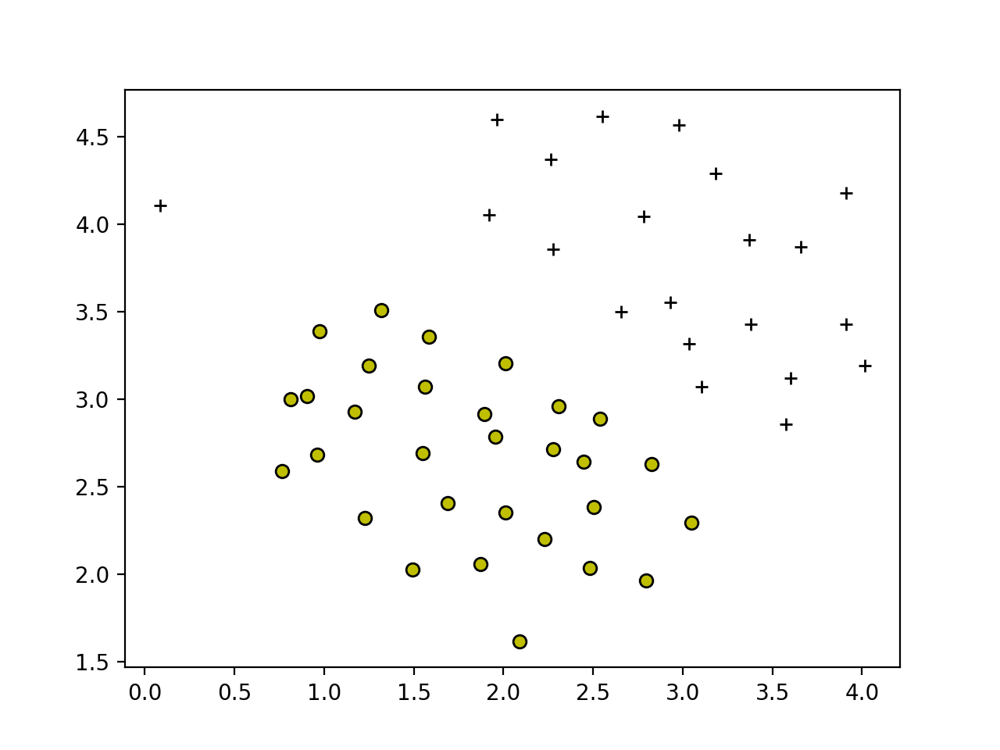

Supervised Learning - Classification - Support Vector Machines (Python)
========================================================================

Run following commands in Python3, and in the local path where all files are present in local Python folder. 

You need to install [Matplotlib](https://matplotlib.org/index.html) which we are using for plotting the data. 

To [install](https://matplotlib.org/users/installing.html) Matplotlib on Mac run following command: 

`$ python3 -m pip install -U matplotlib`

# Goal
In the first part, we will use Support Vector Machines (SVMs) with various example 2D datasets. Experimenting with these datasets will help us gain an intuition of how SVMs work and how to use a Gaussian kernel with SVMs. 

In the next part, we will use Support Vector Machines to build a spam classifier.

Support Vector Machines (SVMs) Intuition
=========================================

## Goal

In this part, we will begin by with a 2D example dataset which can be separated by a linear boundary. We will plot the training data. In this dataset, the positions of the positive examples (indicated with +) and the negative examples (indicated with o) suggest a natural separation indicated by the gap. However, notice that there is an outlier positive example + on the far left at about (0.1, 4.1).We will also see how this outlier affects the SVM decision boundary.

We will try using different values of the C parameter with SVMs. Informally, the C parameter is a positive value that controls the penalty for misclassified training examples. A large C parameter tells the SVM to try to classify all the examples correctly. C plays a role similar to 1/&lambda; , where &lambda; is the regularization parameter that we were using previously for logistic regression.

## Working with Data Set 1 (linear)

### Load Data Set 1 

Module `loadData.py` will be used to load data. We will use this module in other python files. 

This will set X and y variables.

### Visualize Data Set 1

Plot to visualize the data. 

Plotting data with `+` indicating (y = 1) examples and `o` indicating (y = 0) examples.

Run plotData.py from command prompt:

`$ python3 plotData.py`

## Training Linear SVM 

We will call custom function `svmTrain` to train a linear SVM on the dataset and plot the decision boundary learned.

Note: You should not code SVM algorithm yourself. You should use the libraries which implemented this algorithm already. For this part we are using the function which was pre-written for us. 

### Training Linear SVM

#### Train and Plot for `C = 1`

Run svmTrain.py from command prompt:

`$ python3 svmTrain.py`

#### Train and Plot for `C = 100`

Run svmTrain.py from command prompt:

`$ python3 svmTrain.py`

#### Conclusion 
For `C = 100`, we see that the SVM now classifies every single example correctly, but has a decision boundary that does not appear to be a natural fit for the data. Therefore, for `C = 1`, it seems natural fit. 

## Implementing Gaussian Kernel
We will be using SVMs to do non-linear classification. In particular, you will be using SVMs with Gaussian kernels on datasets that are not linearly separable.

Gaussian kernel is a similarity function that measures the “distance” between a pair of examples, (x(i),x(j)). The Gaussian kernel is also parameterized by a bandwidth parameter, &sigma;, which determines how fast the similarity metric decreases (to 0) as the examples are further apart.

First, we will implement Gaussian Kernel in our code and test it with some sample data.

Run gaussianKernel.py from command prompt:

`$ python3 gaussianKernel.py`

Expected value: `0.32465`

## Working with Data Set 2 (non-linear)

### Load Data Set 2 

Module `loadData2.py` will be used to load data. We will use this module in other python files. 

This will set X and y variables.

### Visualize Data Set 2

Run plotData.py from command prompt for data set 2:

`$ python3 plotData.py`

From the above figure, we can obserse that there is no linear decision boundary that separates the positive and negative examples for this dataset. However, by using the Gaussian kernel with the SVM, we will be able to learn a non-linear decision boundary that can perform reasonably well for the dataset.

### Training SVM with Gaussian Kernel

#### Train and Plot for `C = 1` and &sigma;= `0.1`

Run svmTrainGaussian.py from command prompt for data set 2:

`$ python3 svmTrainGaussian.py`

Above figure shows the decision boundary found by the SVM with a Gaussian kernel. The decision boundary is able to separate most of the positive and negative examples correctly and follows the contours of the dataset well.

## Working with Data Set 3 

### Load Data Set 3

Module `loadData3.py` will be used to load data. We will use this module in other python files. 

This will set X, y, Xval, yval variables.

### Visualize Data Set 3

Run plotData.py from command prompt for data set 3:

`$ python3 plotData.py`

### Training SVM with Gaussian Kernel

We will use the cross validation set Xval, yval to determine the best C and &sigma; parameter to use.

We will implement function `dataset3Params` to calculate values of C and &sigma;.

Run dataset3Params.py from command prompt:

`$ python3 dataset3Params.py`

Expected value of C: `0.3`

Expected value of &sigma;: `0.1`

