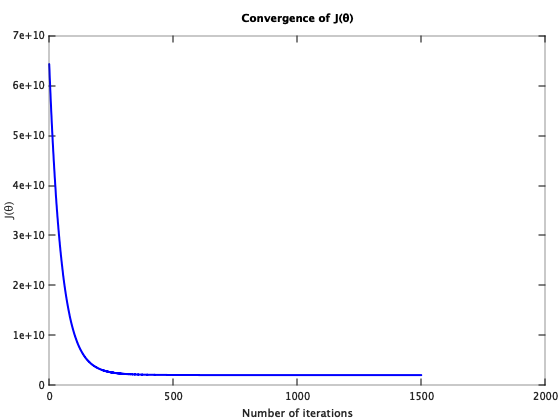

Supervised Learning - Linear Regression with Multiple Variable (Octave)
========================================================================

Note: You can run below code in either Octave or Matlab.

Octave is a free software for mathematics and plotting. You can install Octave from [here](https://www.gnu.org/software/octave/).

Run following commands in Octave, and in the local path where all files are present in local Octave folder. 

`$ octave`

Once in Octave prompt, change the prompt to `>>>` using below command:

`PS1('>>>')`

# Load Data

## Initialization

Clear all variables 
`>>> clear`

Close all plot windows `>>> close all`

Clear command window/screen `>>> clc`

Load data 

`>>> data = load('data.txt')`

### Set X and y

In our test data: 

X1 refers to the size of the house (in square feet)

X2 refers to the number of bedrooms

y refers to the price of the house

Note: Octave is 1 index based so first column is index 1. 

`>>> X = data(:, 1:2) %contain X1 and X2`

`>>> y = data(:, 3)`

`>>> m = length(y)  %number of training examples`

# Feature Normalization/Scaling

In our training example house sizes are about 1000 times the number of bedrooms. When features differ by orders of magnitude, first performing feature scaling can make gradient descent converge much more quickly.

Call custom function featureNormalize:

`>>> [X mu sigma] = featureNormalize(X)`

Note: Octave prompt shoud be in the same path where custom functions (featureNormalize or other custom function we are going to use below) are.

To check the current path run `pwd` in Octave prompt. You can use normal linux commands i.e. `ls` and `cd` to check / change paths. 

# Call cost function computeCost to calculate J(&theta;)

### Add 1 as first column to matrix 'X' for xo = 1 

`>>> X = [ones(m, 1) X]  %We are using normalized features here`

`>>> y = data(:, 3)`

### Set &theta;o, &theta;1 and &theta;2 to zero (2x1 vector)

`>>> theta = zeros(3, 1) %since we have 2 feartures and first column as 1 for X0=1`

### Call cost function

`>>> J = computeCost(X, y, theta)`

Expected value: `65591548106.45744`

### Set &theta;o = -1, &theta;1 = 2 and &theta;2 = 3 and call cost function again

`>>> theta = [-1 ; 2; 3]`

`>>> J = computeCost(X, y, theta)`

Expected value: `65591516892.34798`

# Train Model - Gradient descent 
We will use Gradient descent to minimize cost function J(&theta;) and use it to train our model.

Gradient descent is used to minimize cost function J(&theta;). 

Cost function J(&theta;) will decrease and at the end of iterations will give constant same values. That will be the local minimum. 

This will give the parameters (value of &theta;) to be used for hypothesis h&theta;(x)

Note: For large data set, we train model once and save the parameters &theta;. We use these saved parameters later for prediction. 

### Initialize X and y

Normalize features: 

`>>> X = data(:, 1:2)`

`>>> y = data(:, 3)`

`>>> [X mu sigma] = featureNormalize(X)`

`>>> X = [ones(m, 1) X]`

### Set &theta;o, &theta;1 and &theta;2 to zero (2x1 vector)
`>>> theta = zeros(3, 1)  %No of features + 1`

### Call Gradient descent function 
`>>> iterations = 1500`

`>>> alpha = 0.01`

`>>> [theta, J_history] = gradientDescent(X, y, theta, alpha, iterations)`

Expected value of &theta; is (&theta;o, &theta;1, &theta;2) = `(340412.56301, 110540.56655, -6558.99055)`

# Plot the convergence graph

Find learning rates (&alpha;) that converges quickly. In our example we choose &alpha; = 0.01 with 1500 iterations. Graph below shows good convergence.

`>>> figure`

`>>> plot(1:numel(J_history), J_history, '-b', 'LineWidth', 2)`

`>>> xlabel('Number of iterations')`

`>>> ylabel('J(\theta)')`

`>>> title('Convergence of J(\theta)')`

# Prediction

Estimate the price of a 1650 sq-ft, 3 bedroom house using Gradient Descent.

We will use the parameter &theta; we trained using gradient descent. We wil apply &theta; to the following model to calculate h&theta;(x) which will be the predicted value for new data set.

h&theta;(x) = &theta;oxo  + &theta;1x1 + &theta;1x1

`>>> X_predict = [1, 1650, 3]`

### Normalize features:

`>>> X_predict(1,2) = (X_predict(1,2) - mu(1,1))/(sigma(1,1))`

`>>> X_predict(1,3) = (X_predict(1,3) - mu(1,2))/(sigma(1,2))`

`>>> price = X_predict * theta`

Expected value: `293101.05686`

Estimated price of a 1650 sq-ft, 3 bedroom house using Gradient Descent is: `293101.05686`

# Normal Equation 

Normal equation is another method calculating J(&theta;) and associated &theta; parameters like Gradient Descent. 

Using this formula does not require any feature scaling, and you will get an exact solution in one calculation: there is no “loop until convergence” like in gradient descent.

`>>> X = data(:, 1:2)`

`>>> y = data(:, 3)`

`>>> X = [ones(m, 1) X]`

`>>> theta = normalEqn(X,y)`

Expected value of &theta; is (&theta;o, &theta;1, &theta;2) = `(89597.90954, 139.21067, -8738.01911)`

## Prediction

Estimate the price of a 1650 sq-ft, 3 bedroom house using Normal Equation.

Using calculated h&theta;(x):

h&theta;(x) = &theta;oxo  + &theta;1x1 + &theta;1x1

`>>> X_predict = [1, 1650, 3]`

`>>> price = X_predict * theta`

Expected value: `293081.46433`

Estimated price of a 1650 sq-ft, 3 bedroom house using Normal Equation is: `293081.46433`

