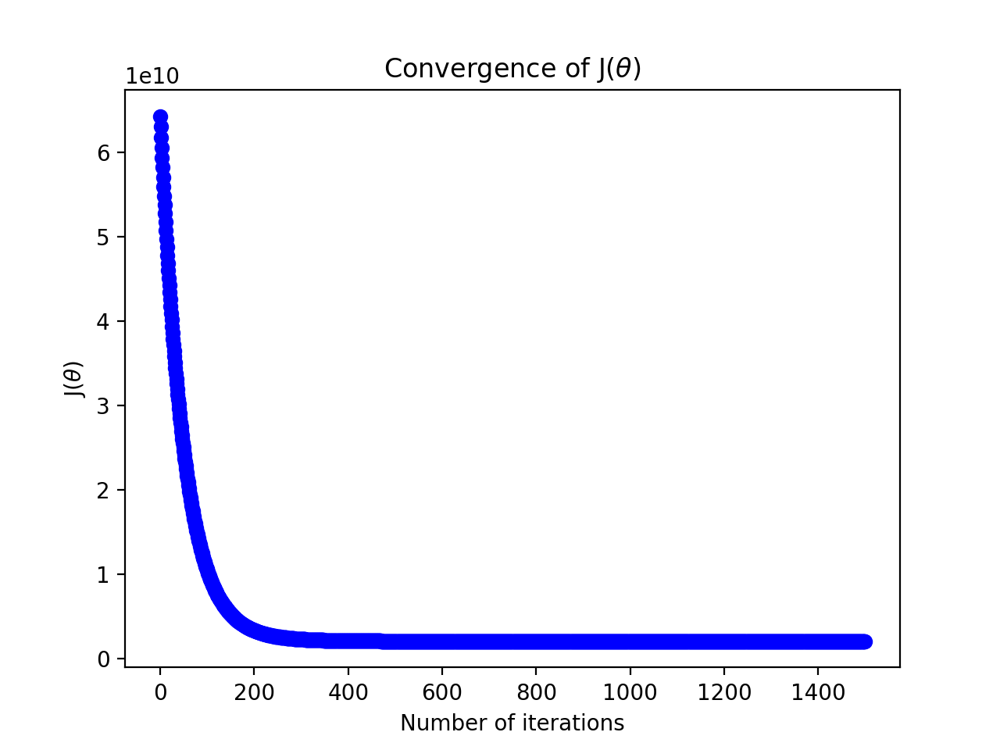

Supervised Learning - Linear Regression with Multiple Variable (Python)
========================================================================

Run following commands in Python3, and in the local path where all files are present in local Python folder. 

You need to install [Matplotlib](https://matplotlib.org/index.html) which we are using for plotting the data. 

To [install](https://matplotlib.org/users/installing.html) Matplotlib on Mac run following command: 

`$ python3 -m pip install -U matplotlib`

# Load Data

Module `loadData.py` will be used to load data. We will use this module in other python files. 

In our test data: 

X1 refers to the size of the house (in square feet)

X2 refers to the number of bedrooms

y refers to the price of the house

Note: Python is 0 index based so first column is index 0. 

# Feature Normalization/Scaling

In our training example house sizes are about 1000 times the number of bedrooms. When features differ by orders of magnitude, first performing feature scaling can make gradient descent converge much more quickly.

Run featureNormalize.py from command prompt: 

`$ python3 featureNormalize.py`

Script will call the featureNormalize function and will return normalized X, mean, standrd deviation (sigma). 

# Call cost function computeCost to calculate J(&theta;)

Run computeCost.py from command prompt: 

`$ python3 computeCost.py`

Script will call the computeCost function with following values:
* (&theta;o, &theta;1, &theta;2) =  `(0,0)` 
* (&theta;o, &theta;1, &theta;2) = `(-1,2,3)`. 

Function will add 1 as first column to normalized X for xo = 1.

Expected value for (0,0,0): `65591548106.45744`

Expected value for (-1,2,3): `65591516892.34798`

# Gradient descent 
Gradient descent is used to minimize cost function J(&theta;).

Run gradientDescent.py from command prompt: 

`$ python3 gradientDescent.py`

Script will call the gradientDescent function with following values:

* (&theta;o, &theta;1, &theta;2) =  `(0,0,0)`  
* iterations = `400`
* &alpha; = `0.01`

Function will add 1 as first column to normalized X for xo = 1.

Cost function J(&theta;) will decrease and at the end of iterations will give constant same values. That will be the local minimum. 

This will give the parameters (value of &theta;) to be used for hypothesis h&theta;(x)

Expected value of &theta; is (&theta;o, &theta;1, &theta;2) = `(334302.06399328, 99411.44947359, 3267.01285407)`

# Plot the convergence graph

Find learning rates (&alpha;) that converges quickly. In our example we choose &alpha; = 0.01 with 400 iterations. Graph below shows good convergence.

Run plotConvergence.py from command prompt:

`$ python3 plotConvergence.py`

Script will call the plotConvergence function which will do following:
* Normalize X  
* Function will add 1 as first column to normalized X for xo = 1.
* Call gradientDescent function from gradientDescent.py module to return J_history 
* Plot J(&theta;) against Number of iterations

# Prediction

Estimate the price of a 1650 sq-ft, 3 bedroom house using Gradient Descent.

Using calculated h&theta;(x):

h&theta;(x) = &theta;oxo  + &theta;1x1 + &theta;1x1

Run predictBasedOnGradientDescent.py from command prompt:

`$ python3 predictBasedOnGradientDescent.py`

Script will call the predictBasedOnGradientDescent function which will do following:
* Call featureNormalize function from featureNormalize.py to get mu and sigma
* Normalize prediction values (1650,3)
* Call gradientDescent function from gradientDescent.py module to calculate minimum of cost function J(&theta;) and return &theta;o, &theta;1, and &theta;2. 
* Calculate  h&theta;(x) using h&theta;(x) = &theta;oxo  + &theta;1x1 + &theta;2x2

Expected value: `289221.54737122`

Estimated price of a 1650 sq-ft, 3 bedroom house using Gradient Descent is: `289221.54737122`

# Normal Equation 

Normal equation is another method calculating J(&theta;) and associated &theta; parameters like Gradient Descent. 

Using this formula does not require any feature scaling, and you will get an exact solution in one calculation: there is no “loop until convergence” like in gradient descent.

Run normalEqn.py from command prompt:

`$ python3 normalEqn.py`

Script will call the normalEqn function which will do following:
* Function will add 1 as first column to X for xo = 1.
* Calculate minimum of cost function J(&theta;) and return &theta;o, &theta;1, and &theta;2

Expected value of &theta; is (&theta;o, &theta;1, &theta;2) = `(89597.90954355, 139.21067402, -8738.01911255)`

## Prediction

Estimate the price of a 1650 sq-ft, 3 bedroom house using Normal Equation.

Using calculated h&theta;(x):

h&theta;(x) = &theta;oxo  + &theta;1x1 + &theta;1x1

Run predictBasedOnNormalEqn.py from command prompt:

`$ python3 predictBasedOnNormalEqn.py`

Script will call the predictBasedOnNormalEqn function which will do following:
* Call normalEqn function from normalEqn.py to calculate minimum of cost function J(&theta;) and return &theta;o, &theta;1, and &theta;2 
* Calculate  h&theta;(x) using h&theta;(x) = &theta;oxo  + &theta;1x1 + &theta;2x2

Expected value: `293081.46433497`

Estimated price of a 1650 sq-ft, 3 bedroom house using Normal Equation is: `293081.46433497`

