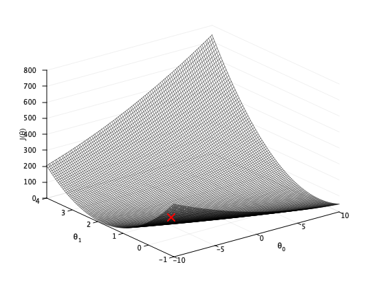
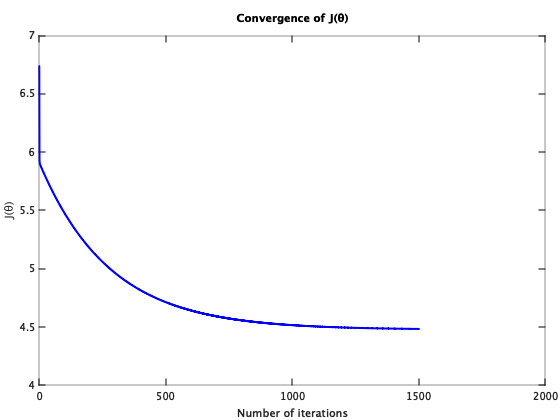

Supervised Learning - Linear Regression with One Variable (Octave)
===================================================================

Note: You can run below code in either Octave or Matlab.

Octave is a free software for mathematics and plotting. You can install Octave from [here](https://www.gnu.org/software/octave/).

Run following commands in Octave, and in the local path where all files are present in local Octave folder. 

`$ octave`

Once in Octave prompt, change the prompt to `>>>` using below command:

`PS1('>>>')`

# Load Data

## Initialization

Clear all variables 
`>>> clear`

Close all plot windows `>>> close all`

Clear command window/screen `>>> clc`

Load data 

`>>> data = load('data.txt')`

### Set X and y
X refers to the population size in 10,000s

y refers to the profit in $10,000s

Note: Octave is 1 index based so first column is index 1. 

`>>> X = data(:, 1)`

`>>> y = data(:, 2)`

`>>> m = length(y)  %number of training examples`

### Plot data calling plotData custom function
`>>> plotData(X,y)`

Note: Octave prompt shoud be in the same path where custom functions (plotData or other custom function we are going to use below) are.

To check the current path run `pwd` in Octave prompt. You can use normal linux commands i.e. `ls` and `cd` to check / change paths. 

# Call cost function computeCost to calculate J(&theta;)

### Add 1 as first column to matrix 'X' for xo = 1 

`>>> X = [ones(length(data),1),data(:,1)]`

`>>> y = data(:, 2)`

### Set &theta;o and &theta;1 to zero (2x1 vector)

`>>> theta = zeros(2, 1)`

### Call cost function

`>>> J = computeCost(X, y, theta)`

Expected value: `32.073`

### Set &theta;o = -1 and &theta;1 = 2 and call cost function again

`>>> theta = [-1 ; 2]`

`>>> J = computeCost(X, y, theta)`

Expected value: `54.242`

# Gradient descent 
Gradient descent is used to minimize cost function J(&theta;).

### Initialize X and y
`>>> X = [ones(length(data),1),data(:,1)]`

`>>> y = data(:, 2)`

### Set &theta;o and &theta;1 to zero (2x1 vector)
`>>> theta = zeros(2, 1)`

### Call Gradient descent function 
`>>> iterations = 1500`

`>>> alpha = 0.01`

`>>> [theta, J_history] = gradientDescent(X, y, theta, alpha, iterations)`

Cost function J(&theta;) will decrease and at the end of iterations will give constant same values. That will be the local minimum. 

This will give the parameters (value of &theta;) to be used for hypothesis h&theta;(x)

Expected value of &theta; is (&theta;o, &theta;1) = `(-3.6303, 1.1664)`

# Plot h&theta;(x)

Calculate h&theta;(x) with calculated &theta; value above.

`>>> hx = X * theta`

### Plot Data
`>>> plotData(X(:,2),y)  %calling plotData custom function`

`>>> hold on  %overlay on top of previous figure`

`>>> plot(X(:,2),hx)`

`>>> legend ("Training data","Linear regression","location","southeast")`

# Prediction
Using calculated h&theta;(x)

h&theta;(x) = &theta;oxo  + &theta;1x1

`>>> predict1 = [1, 3.5] * theta  %using vectorisation` 

Expected value: `0.45198`

`>>> predict2 = [1, 7] * theta`

Expected value: `4.5342`

# Visualizing J(&theta;)

### Calculate J(&theta;)

Calculate J(&theta;) by calling custom function calculateJtheta

`>>> [theta0_vals,theta1_vals,J_vals] = calculateJtheta(X, y)`

Because of the way meshgrids work in the surf command, we need to
transpose J_vals before calling surf, or else the axes will be flipped

`>>> J_vals = J_vals'`

## Surface Plot
`>>> figure`

`>>> surf(theta0_vals, theta1_vals, J_vals)`

`>>> xlabel('\theta_0')`

`>>> ylabel('\theta_1')`

`>>> zlabel('J(\theta)')`

To see local minimum on surface add plot:

`>>> hold on`

`>>> plot(theta(1), theta(2), 'rx', 'MarkerSize', 5, 'LineWidth', 2)`

Rotate the surface to see red cross X at the bottom. This is minimum J(&theta;) for (&theta;o, &theta;1) = `(-3.6303, 1.1664)`

## Contour plot

`>>> figure`

Plot J_vals as 15 contours spaced logarithmically between 0.01 and 100

`>>> contour(theta0_vals, theta1_vals, J_vals, logspace(-2, 3, 20))`

`>>> xlabel('\theta_0'); ylabel('\theta_1')`

`>>> hold on`

`>>> plot(theta(1), theta(2), 'rx', 'MarkerSize', 5, 'LineWidth', 2)`

Where (&theta;o, &theta;1) = `(-3.6303, 1.1664)`

