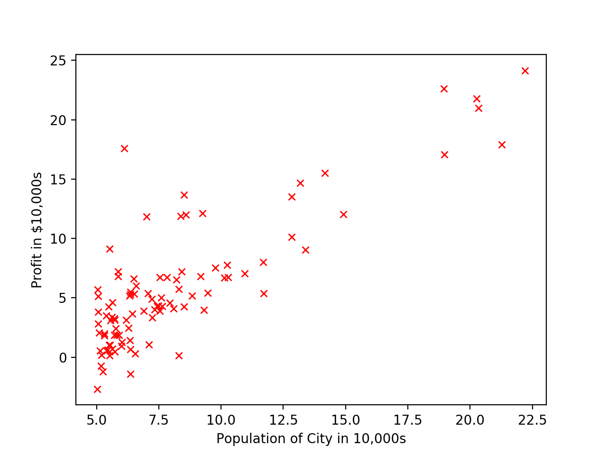
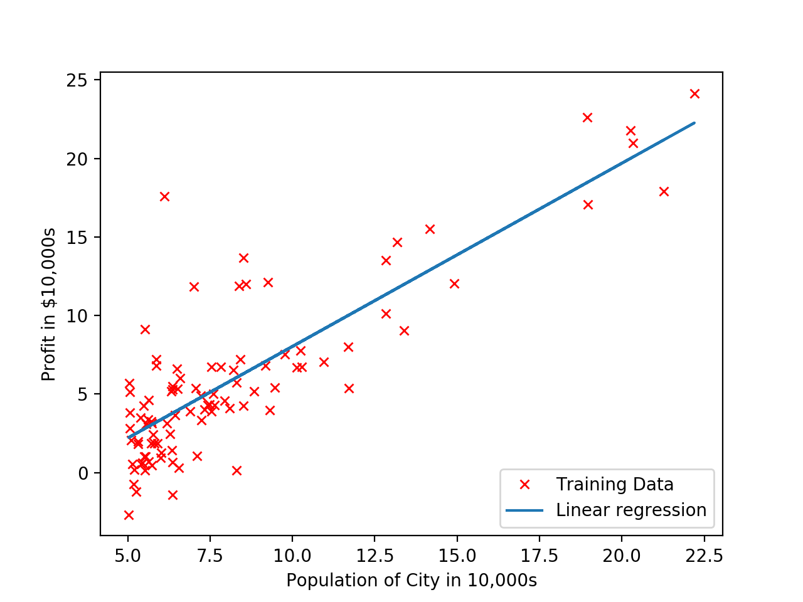
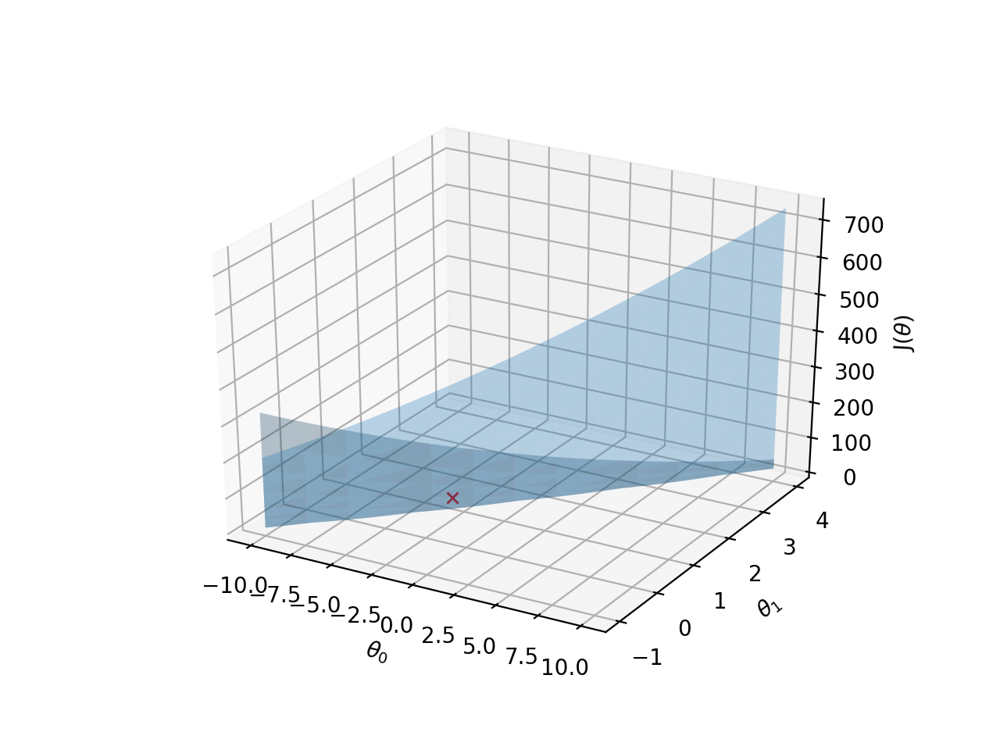
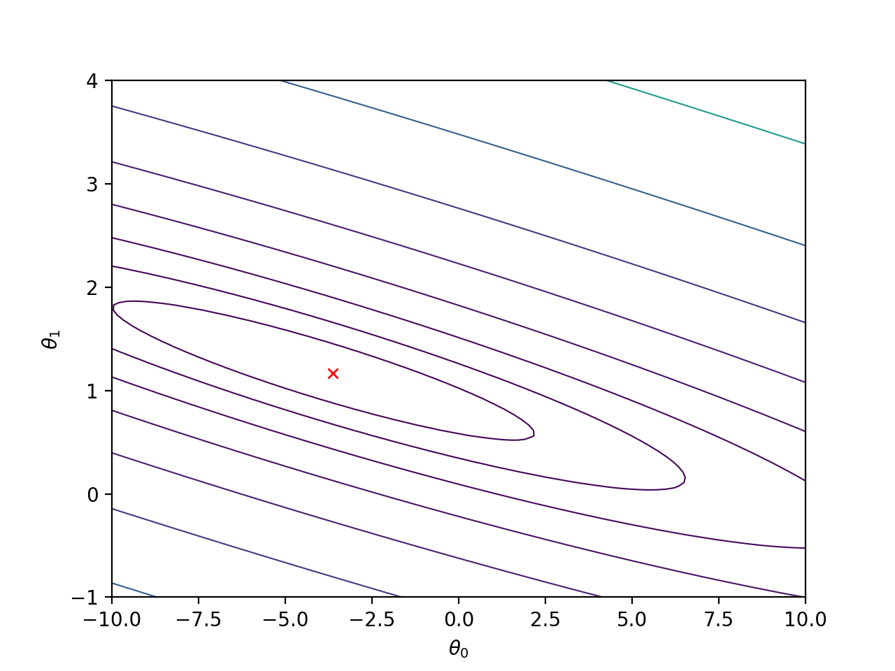

Supervised Learning - Linear Regression with One Variable (Python)
===================================================================

Run following commands in Python3, and in the local path where all files are present in local Python folder. 

You need to install [Matplotlib](https://matplotlib.org/index.html) which we are using for plotting the data. 

To [install](https://matplotlib.org/users/installing.html) Matplotlib on Mac run following command: 

`$ python3 -m pip install -U matplotlib`

# Load Data

Module `loadData.py` will be used to load data. We will use this module in other python files. 

In our test data:

X refers to the population size in 10,000s

y refers to the profit in $10,000s

### Plot data calling plotData custom function

Run plotData.py from command prompt:

`$ python3 plotData.py`

# Call cost function computeCost to calculate J(&theta;)

Run computeCost.py from command prompt: 

`$ python3 computeCost.py`

Script will call the computeCost function for (&theta;o, &theta;1) =  `(0,0)` and (&theta;o, &theta;1) = `(-1,2)`. 

Expected value for (0,0): `32.07273388`

Expected value for (-1,2): `54.24245508`

# Gradient descent 
Gradient descent is used to minimize cost function J(&theta;).

Run gradientDescent.py from command prompt: 

`$ python3 gradientDescent.py`

Script will call the gradientDescent function with following values: 

(&theta;o, &theta;1) =  `(0,0)`  

`iterations = 1500`

`alpha = 0.01`

Cost function J(&theta;) will decrease and at the end of iterations will give constant same values. That will be the local minimum. 

This will give the parameters (value of &theta;) to be used for hypothesis h&theta;(x)

Expected value of &theta; (&theta;o, &theta;1) = `(-3.63029144, 1.16636235)`

# Plot h&theta;(x)

Run plot_H_Theta.py from command prompt:

`$ python3 plot_H_Theta.py`

Script will call the plot_H_Theta function which will do following: 
* Call gradientDescent function from gradientDescent.py module to calculate minimum of cost function J(&theta;) and return &theta;o, &theta;1. 
* Calculate  h&theta;(x) using h&theta;(x) = &theta;oxo  + &theta;1x1
* Plot h&theta;(x) against the value of y.

# Prediction
Using calculated h&theta;(x)

h&theta;(x) = &theta;oxo  + &theta;1x1

Run predict.py from command prompt:

`$ python3 predict.py`

Script will call the predict function which will do following:

* Call gradientDescent function from gradientDescent.py module to calculate minimum of cost function J(&theta;) and return &theta;o, &theta;1. 
* Calculate  h&theta;(x) using h&theta;(x) = &theta;oxo  + &theta;1x1

Expected value for  (xo,x1) (1, 3.5): `0.45197679`

Expected value for  (xo,x1) (1, 7): `4.53424501`

For population = 35,000, we predict a profit of 4519.767868

For population = 70,000, we predict a profit of 45342.450129

# Visualizing J(&theta;)

## Surface Plot

Run surfacePlot_J_Theta.py from command prompt:

`$ python3 surfacePlot_J_Theta.py`

Script will call the surfacePlot_J_Theta function which will do following:

* Calculate values of &theta;o, &theta;1 and J(&theta;)
* Call gradientDescent function from gradientDescent.py module to calculate minimum of cost function J(&theta;) and return &theta;o, &theta;1. 
* Plot Surface
* Plot local minimum for J(&theta;)

Red cross X at the bottom is the minimum J(&theta;) for (&theta;o, &theta;1) = `(-3.6303, 1.1664)`

## Contour plot

Run contourPlot_J_Theta.py from command prompt:

`$ python3 contourPlot_J_Theta.py`

Script will call the contourPlot_J_Theta function which will do following:

* Calculate values of &theta;o, &theta;1 and J(&theta;)
* Call gradientDescent function from gradientDescent.py module to calculate minimum of cost function J(&theta;) and return &theta;o, &theta;1. 
* Plot Contour spaced logarithmically between 0.01 and 100 l`ogspace(-2, 3, 20)`
* Plot local minimum for J(&theta;)

Red cross X is the minimum J(&theta;) for (&theta;o, &theta;1) = `(-3.6303, 1.1664)`

