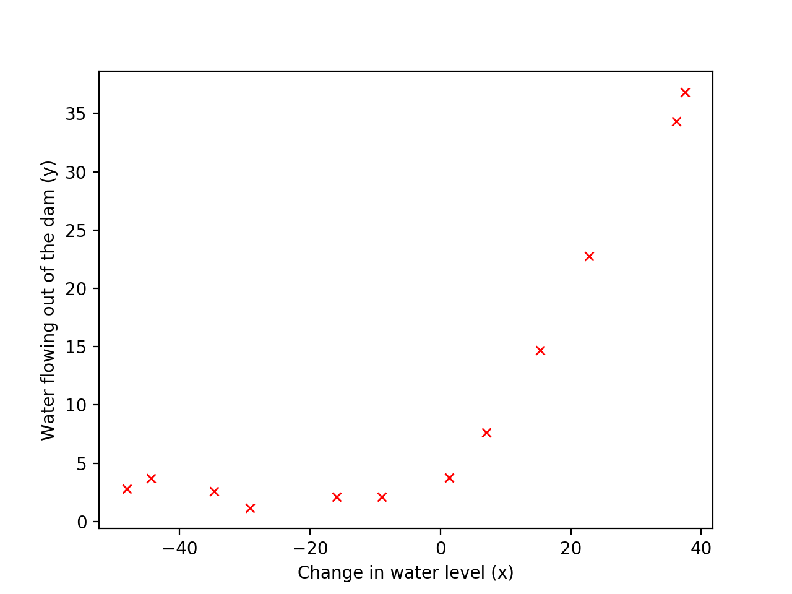

Supervised Learning - Regularized Linear Regression and Bias-vs-Variance (Python)
==================================================================================

Run following commands in Python3, and in the local path where all files are present in local Python folder. 

You need to install [Matplotlib](https://matplotlib.org/index.html) which we are using for plotting the data. 

To [install](https://matplotlib.org/users/installing.html) Matplotlib on Mac run following command: 

`$ python3 -m pip install -U matplotlib`

# Goal
We will implement regularized linear regression and use it to study models with different bias-variance properties. First, we will implement regularized linear regression to predict the amount of water flowing out of a dam using the change of water level in a reservoir. Next, we will go through some diagnostics of debugging learning algorithms and examine the effects of bias v.s. variance.

# Load Data

Out dataset contains historical records on the change in the water level, `X`, and the amount of water flowing out of the dam, `y`.

This dataset is divided into three parts:
* A training set that model will learn on: `X`, `y`
* A cross validation set for determining the regularization parameter: `Xval`, `yval`
* A test set for evaluating performance. These are “unseen” examples which your model did not see during training: `Xtest`, `ytest`

Module `loadData.py` will be used to load data. We will use this module in other python files. 

# Plot training data

Run `plotData.py` from command prompt:

`$ python3 plotData.py`

# Regularized Linear Regression Cost 

We will use the linear regression cost function we implemneted before and regularized it with &lambda;.

## Call linearRegCostFunction funciton with intial &theta; of (1,1).

Run `linearRegCostFunction.py` from command prompt: 

`$ python3 linearRegCostFunction.py`

Script will call the linearRegCostFunction function for (&theta;o, &theta;1) =  `(1,1)` and &lambda; = 1. 

Expected value of J: `303.99319222`

Expected value of gradient: `-15.30301567`, `598.25074417`
                        

# Train Model - Advanced Optimization

## Train linear regression with lambda = 0

We will used advanced optimisation technique to get minimum value of cost functio and tran the model. 

Run `trainLinearReg.py` from command prompt: 

`$ python3 trainLinearReg.py`

Script will call the `trainLinearReg` function with following values: 

* (&theta;o, &theta;1) =  `(1,1)`  
* iterations = `200`
* &lambda; = `0`

Expected value of &theta;: `13.08790351`, `0.36777923`
                            

## Plot fit over the data

Run `plotBestFitLine.py` from command prompt: 

`$ python3 plotBestFitLine.py`

Script will call trainLinearReg to train the model and get the value of &theta;. It will plot the value of hypothesis (h(&theta;)).

Above plot shows the best fit line. The best fit line tells us that the model is not a good fit to the data because the data has a non-linear pattern. While visualizing the best fit as shown is one possible way to debug your learning algorithm, it is not always easy to visualize the data and model. In the next section, we will implement a function to generate learning curves that can help you debug your learning algorithm even if it is not easy to visualize the data

# Learning Curve for Linear Regression

We will generates the train and cross validation set errors needed to plot a learning curve. Call `learningCurve` function which will compute the train and cross-validation errors for dataset sizes from `1` up to `m`

For the cross-validation error, function will evaluate on the entire cross validation set (Xval and yval).
While calling cost function `linearRegCostFunction`  to compute the training and cross validation error, we will call the function with the lambda argument set to `0`. However, we still need to use lambda when running the training to obtain the theta parameters.

Run `learningCurve.py` from command prompt: 

`$ python3 learningCurve.py`

Script will calculate learning curve and plot the data for &lambda; = 0

Expected values of `error_train`: 
   `0.00000
    0.00000
    3.28660
    2.84268
   13.15405
   19.44396
   20.09852
   18.17286
   22.60941
   23.26146
   24.31725
   22.37391`

Expected values of `error_val`: 
  `205.121
   110.300
    45.010
    48.369
    35.865
    33.830
    31.971
    30.862
    31.136
    28.936
    29.551
    29.434`

## Plot curve

Since the model is underfitting the data, we expect graph will show "high bias".

# Feature Mapping for Polynomial Regression

The problem with our linear model was that it was too simple for the data and resulted in underfitting (high bias). We will address this problem by adding more features.

One solution to high bias problem is to use polynomial regression. We will call function `polyFeatures` to map each example into its powers.

Run `learningPolynomialRegression.py` from command prompt: 

`$ python3 learningPolynomialRegression.py`

Expected values `X_poly`: 
  ` 1.00 -0.3782437  -0.78866232  0.19032872 -0.7375913   0.32025197
  -0.6171516   0.35983501 -0.53109126`

# Learning Curve for Polynomial Regression 

We will now experiment with polynomial regression with multiple values of lambda. The code below runs polynomial regression with &lambda; values of `0, 1, 100`. 

We can try to run the code with different values of &lambda; to see how the fit and learning curve change.

Run `learningCurveForPolynomial.py` from command prompt: 

`$ python3 learningCurveForPolynomial.py`

## Try with &lambda;=`0` - No Regularization

## Try with &lambda;=`1`

## Try with &lambda;=`100`

## Conclusion 

For &lambda;=`1`, you should see that the polynomial fit is able to follow the datapoints very well,thus, obtaining a low training error. However, the polynomial fit is very complex and even drops off at the extremes. This is an indicator that the polynomial regression model is overfitting the training data and will not generalize well.

To better understand the problems with the unregularized (&lambda; = 0) model, you can see that the learning curve shows the same effect where the low training error is low, but the cross validation error is high. There is a gap between the training and cross validation errors, indicating a high variance problem.

For &lambda; = 1, you should see a polynomial fit that follows the data trend well and a learning curve showing that both the cross validation and training error converge to a relatively low value. This shows the &lambda; = 1 regularized polynomial regression model does not have the high bias or high-variance problems. In effect, it achieves a good trade-off between bias and variance.

For &lambda; = 100, you should see a polynomial fit that does not follow the data well. In this case, there is too much regularization and the model is unable to fit the training data.

By plotting and visually examining data, it show &lambda; = 1 be the best value. 

#  Validation for Selecting Lambda

In this section, we will implement an automated method to select the &lambda; parameter. Concretely, we will use a cross validation set to evaluate how good each &lambda; value is. After selecting the best &lambda; value using the cross validation set, we can then evaluate the model on the test set to estimate how well the model will perform on actual unseen data.

We will now implement validationCurve to test various values of lambda on a validation set. We will then use this to select the "best" lambda value.

We will try &lambda; in the following range: {0, 0.001, 0.003, 0.01, 0.03, 0.1, 0.3, 1, 3, 10}.

Run `validationCurve.py` from command prompt: 

`$ python3 validationCurve.py`

## Conclusion

In this figure, we can see that the best value of &lambda; is around 3. Due to randomness in the training and validation splits of the dataset, the cross validation error can sometimes be lower than the training error.
