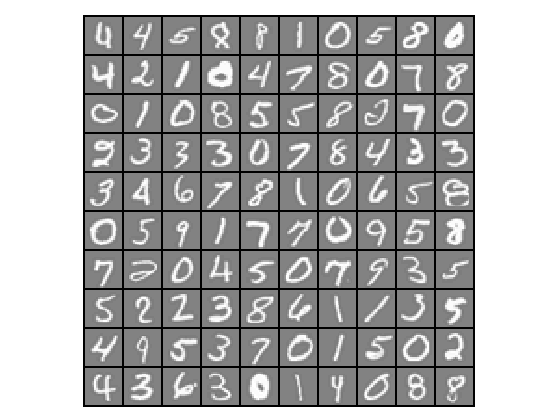

Supervised Learning - Multi-class Classification - One-Vs-All Logistic Regression (Octave)
===========================================================================================

Note: You can run below code in either Octave or Matlab.

Octave is a free software for mathematics and plotting. You can install Octave from [here](https://www.gnu.org/software/octave/).

Run following commands in Octave, and in the local path where all files are present in local Octave folder. 

`$ octave`

Once in Octave prompt, change the prompt to `>>>` using below command:

`PS1('>>>')`

# Goal 
We will implement one-vs-all Logistic Regression to recognize handwritten digits (from 0 to 9). Automated handwritten digit recognition is widely used today, from recognizing zip codes (postal codes) on mail envelopes to recognizing amounts written on bank checks.

We will extend our previous implemention of Logistic Regression and apply it to one-vs-all classification.

# Load Data

We start by first loading and visualizing the dataset.

We will be working with a dataset that contains handwritten digits.

Our  data set in `data.mat` contains 5000 training examples of handwritten digits. The `.mat` format means that the data has been saved in a native Octave/MATLAB matrix format, instead of a text (ASCII) format like a csv-file. These matrices can be read directly into your program by using the load command. After loading, matrices of the correct dimensions and values will appear in your program’s memory. The matrix will already be named, so we do not need to assign names to them.

There are 5000 training examples in `data.mat`, where each training example is a 20x20 pixel grayscale image of the digit. Each pixel is represented by a floating point number indicating the grayscale intensity at that location. The 20x20 grid of pixels is “unrolled” into a 400-dimensional vector. Each of these training examples becomes a single row in our data matrix X. This gives us a 5000x400 matrix X where every row is a training example for a handwritten digit image.

The second part of the training set is a 5000-dimensional vector y that contains labels for the training set. To make things more compatible with Octave/MATLAB indexing, where there is no zero index, we have mapped the digit zero to the value ten. Therefore, a “0” digit is labeled as “10”, while the digits “1” to “9” are labeled as “1” to “9” in their natural order.

## Initialization

Clear all variables 
`>>> clear`

Close all plot windows `>>> close all`

Clear command window/screen `>>> clc`

##  Load Training Data

Setup the parameters we will use

20x20 Input Images of Digits:

`>>> input_layer_size  = 400`  

10 labels, from 1 to 10 (note that we have mapped "0" to label 10): 

`>>> num_labels = 10`          

Training data stored in arrays X, y

`>>> load('data.mat')`

`>>> m = size(X, 1)`

Randomly select 100 data points to display

`>>> rand_indices = randperm(m)`

`>>> sel = X(rand_indices(1:100), :)`

## Display data calling displayData custom function

We will visualize a subset of the training set. We will randomly selects selects 100 rows from X and will pass those rows to the displayData custom function. This function maps each row to a 20x20 pixel grayscale image and displays the images together.

`>>> displayData(sel)`

Note: Octave prompt shoud be in the same path where custom functions (plotData or other custom function we are going to use below) are.

To check the current path run `pwd` in Octave prompt. You can use normal linux commands i.e. `ls` and `cd` to check / change paths. 

# Test Regularized Logistic Regression 

We need to make sure that we have vectorized implementation of cost function. 

Note that we have already implemented the vectorized implementation of cost function `costFunctionReg` in Regularized Logistic Regression section which we will use here. 

`>>> theta_t = [-2; -1; 1; 2]`

`>>> X_t = [ones(5,1) reshape(1:15,5,3)/10]`

`>>> y_t = ([1;0;1;0;1] >= 0.5)`

`>>> lambda_t = 3`

`>>> [J grad] = costFunctionReg(theta_t, X_t, y_t, lambda_t)`

Expected value of cost J: `2.5348`

Expected value of grad: `0.14656`, `-0.54856`, `0.72472`, `1.39800`

# One-vs-All Training

We will use Advanced Optimization custom function fmincg instead of fminunc. fmincg works similar to fminunc, but is more efficient for dealing with a large number of parameters.

In Octave/MATLAB, evaluating the expression a == b for a vector a (of size m×1) and scalar b will return a vector of the same size as a with ones at positions where the elements of a are equal to b and zeroes where they are different. 

For example: 

   a = 1:10

   b = 3

   a == b    
 
 last statement will return `0  0  1  0  0  0  0  0  0  0`

We will use this feature to select one vs all for a selected value. 

For example y==2 will return value of y with 1 set for position of alls 2's and rest will be set to 0.   

`>>> lambda = 0.1`

`>>> [all_theta] = oneVsAll(X, y, num_labels, lambda)`

Get first 4 values of &Theta;:

`>>> all_theta(1:4,1)`

Expected first 4 values of &Theta;: `-3.3122`, `-3.2533`, `-5.0287`, `-2.3967`

# Predict for One-Vs-All

`>>> pred = predictOneVsAll(all_theta, X)`

# Training Set Accuracy

`fprintf('\nTraining Set Accuracy: %f\n', mean(double(pred == y)) * 100)`

Expected value: `95.140000`

# Test Model 

Call custom function predictImg and pass the  20x20 pixel image. Note that we generated these images in Neural Networks Octave implementation. 
 
`>>> p = predictImg(all_theta, './predict-images/3.png')`

Expected value: `3`

Test for all images `0-9`. Node that for `0`, model will return `10` but we will print `0`.
