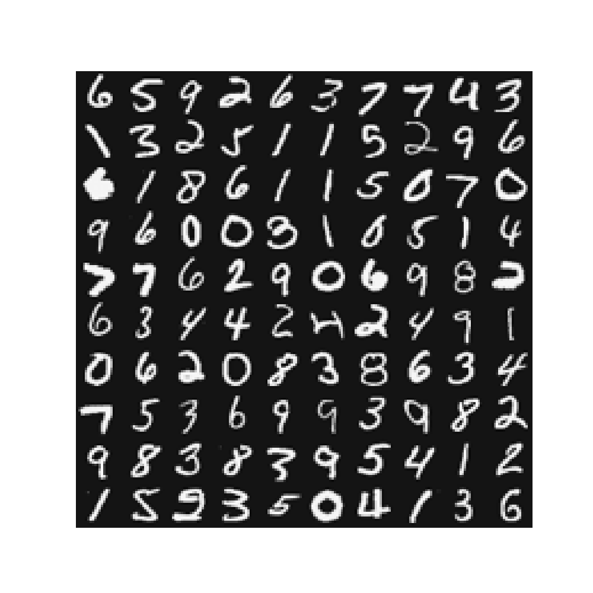

Supervised Learning - Multi-class Classification - One-Vs-All Logistic Regression (Python)
===========================================================================================

Run following commands in Python3, and in the local path where all files are present in local Python folder. 

You need to install [Matplotlib](https://matplotlib.org/index.html) which we are using for plotting the data. 

To [install](https://matplotlib.org/users/installing.html) Matplotlib on Mac run following command: 

`$ python3 -m pip install -U matplotlib`

# Goal 
We will implement one-vs-all Logistic Regression to recognize handwritten digits (from 0 to 9). Automated handwritten digit recognition is widely used today, from recognizing zip codes (postal codes) on mail envelopes to recognizing amounts written on bank checks.

We will extend our previous implemention of Logistic Regression and apply it to one-vs-all classification.

# Load Data

We start by first loading and visualizing the dataset.

We will be working with a dataset that contains handwritten digits.

Our  data set in `data.mat` contains 5000 training examples of handwritten digits. The `.mat` format means that the data has been saved in a native Octave/MATLAB matrix format, instead of a text (ASCII) format like a csv-file. These matrices can be read directly into your program by using the load command. After loading, matrices of the correct dimensions and values will appear in your program’s memory. The matrix will already be named, so we do not need to assign names to them.

There are 5000 training examples in `data.mat`, where each training example is a 20x20 pixel grayscale image of the digit. Each pixel is represented by a floating point number indicating the grayscale intensity at that location. The 20x20 grid of pixels is “unrolled” into a 400-dimensional vector. Each of these training examples becomes a single row in our data matrix X. This gives us a 5000x400 matrix X where every row is a training example for a handwritten digit image.

The second part of the training set is a 5000-dimensional vector y that contains labels for the training set. To make things more compatible with Octave/MATLAB indexing, where there is no zero index, we have mapped the digit zero to the value ten. Therefore, a “0” digit is labeled as “10”, while the digits “1” to “9” are labeled as “1” to “9” in their natural order.

##  Load Training Data

Module `loadData.py` will be used to load data. We will use this module in other python files. 

## Display data calling displayData custom function

We will visualize a subset of the training set. We will randomly selects rows from X. This function maps each row to a 20x20 pixel grayscale image and displays the images together.

Run displayData.py from command prompt:

`$ python3 displayData.py`

# Test Regularized Logistic Regression 

We need to make sure that we have vectorized implementation of cost function. 

Note that we have already implemented the vectorized implementation of cost function `costFunctionReg` in Regularized Logistic Regression section which we will use here. 

Run costFunctionReg.py from command prompt:

`$ python3 costFunctionReg.py`

Script will call the costFunctionReg function and will calculate cost with follwing values:
* &Theta; = `(-2, -1, 1, 2)`
* X = 5x3 matrix of number 1-15 &divide; 10, with 1 appended to the matrix to make it 5x4
* y = 1x1 vector with values `1 0 1 0 1`
* &lambda; = `3`

Expected value of cost J: `2.5348194`

Expected value of grad: `0.14656137`, `-0.54855841`, `0.72472227`, `1.39800296`

# One-vs-All Training

We will use Advanced Optimization function fmin_cg from scipy library instead of minimize. fmin_cg works similar to minimize, but is more efficient for dealing with a large number of parameters.

Run oneVsAll.py from command prompt:

`$ python3 oneVsAll.py`

Script will call the oneVsAll function which will do following:
* Call `calculateOptimizeTheta` function in `optimizeTheta.py` module with &lambda; = 0.1 for handwritten numbers 1-10

Expected first 4 values of &Theta;: `-3.00407911`, `-2.95000729`, `-4.88676598`, `-2.2890568`

# Predict for One-Vs-All

Run predictOneVsAll.py from command prompt:

`$ python3 predictOneVsAll.py`

Script will call the predictOneVsAll function which will do following:
* Call `oneVsAll` function in `oneVsAll.py` module with &lambda; = 0.1 for handwritten numbers 1-10

Expected first 4 values of &Theta;: `10`, `10`, `10`, `10`

# Training Set Accuracy

Run computeAccuracy.py from command prompt:

`$ python3 computeAccuracy.py`

Script will call the computeAccuracy function which will do following:
* Call `predictOneVsAll` function in `predictOneVsAll.py` module

Expected value: `95.08`

# Test Model 

Call custom function predictImg and pass the  20x20 pixel image. Note that we generated these images in Neural Networks Octave implementation. 
 
 `$ python3 predictImg.py`

Expected value: `4`

Test for all images `0-9`. Node that for `0`, model will return `10` but we will print `0`.

