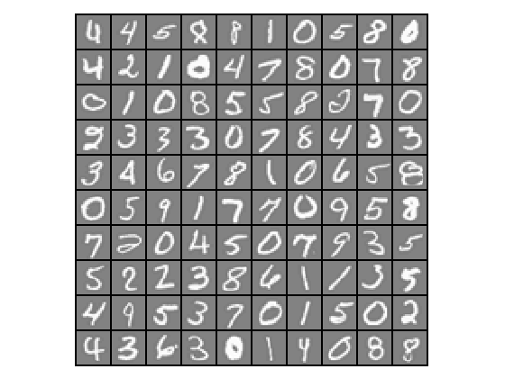

Supervised Learning - Neural Networks - Feedforward Propagation (Octave)
===========================================================================================

Note: You can run below code in either Octave or Matlab.

Octave is a free software for mathematics and plotting. You can install Octave from [here](https://www.gnu.org/software/octave/).

Run following commands in Octave, and in the local path where all files are present in local Octave folder. 

`$ octave`

Once in Octave prompt, change the prompt to `>>>` using below command:

`PS1('>>>')`

# Goal 
We previously implemented multi-class logistic regression to recognize handwritten digits. However, logistic regression cannot form more complex hypotheses as it is only a linear classifier.

In this part we will implement a neural network to recognize handwritten digits using the same training set as before. The neural network will be able to represent complex models that form non-linear hypotheses. 

we will be using parameters from a neural network that we have already trained. Our goal is to implement the feedforward propagation algorithm to use our weights for prediction. 

# Load Data

We start by first loading and visualizing the dataset.

We will be working with a dataset that contains handwritten digits.

Our  data set in `data.mat` contains 5000 training examples of handwritten digits. The `.mat` format means that the data has been saved in a native Octave/MATLAB matrix format, instead of a text (ASCII) format like a csv-file. These matrices can be read directly into your program by using the load command. After loading, matrices of the correct dimensions and values will appear in your program’s memory. The matrix will already be named, so we do not need to assign names to them.

There are 5000 training examples in `data.mat`, where each training example is a 20x20 pixel grayscale image of the digit. Each pixel is represented by a floating point number indicating the grayscale intensity at that location. The 20x20 grid of pixels is “unrolled” into a 400-dimensional vector. Each of these training examples becomes a single row in our data matrix X. This gives us a 5000x400 matrix X where every row is a training example for a handwritten digit image.

The second part of the training set is a 5000-dimensional vector y that contains labels for the training set. To make things more compatible with Octave/MATLAB indexing, where there is no zero index, we have mapped the digit zero to the value ten. Therefore, a “0” digit is labeled as “10”, while the digits “1” to “9” are labeled as “1” to “9” in their natural order.

## Initialization

Clear all variables 
`>>> clear`

Close all plot windows `>>> close all`

Clear command window/screen `>>> clc`

##  Load Training Data

Training data stored in arrays X, y

`>>> load('data.mat')`

`>>> m = size(X, 1)`

Randomly select 100 data points to display

`>>> rand_indices = randperm(m)`

`>>> sel = X(rand_indices(1:100), :)`

## Display data calling displayData custom function

We will visualize a subset of the training set. We will randomly selects selects 100 rows from X and will pass those rows to the displayData custom function. This function maps each row to a 20x20 pixel grayscale image and displays the images together.

`>>> displayData(sel)`

Note: Octave prompt shoud be in the same path where custom functions (plotData or other custom function we are going to use below) are.

To check the current path run `pwd` in Octave prompt. You can use normal linux commands i.e. `ls` and `cd` to check / change paths. 

## Load trained parameters 

We are going to use network parameters (&Theta;(1), &Theta;(2)) which are already trained by us. These are stored in `weights.mat` and will be loaded into Theta1 and Theta2. The parameters have dimensions that are sized for a neural network with 25 units in the second layer and 10 output units (corresponding to the 10 digit classes).

% Load the weights into variables Theta1 and Theta2

`>>> load('weights.mat')`

# Prediction

Predict by calling custom function 

`>>> pred = predict(Theta1, Theta2, X)`

Get first 4 values of pred:

`>>> pred(1:4,1)`

Expected first 4 values of &Theta;: `10`, `10`, `10`, `10`

# Training Set Accuracy

`>>> fprintf('\nTraining Set Accuracy: %f\n', mean(double(pred == y)) * 100)`

Expected value: `97.520000`

To give you an idea of the network's output, you can also run through the examples one at the a time to see what it is predicting.

Call custom function displayPrediction:

`>>> displayPrediction(Theta1, Theta2, X)`

