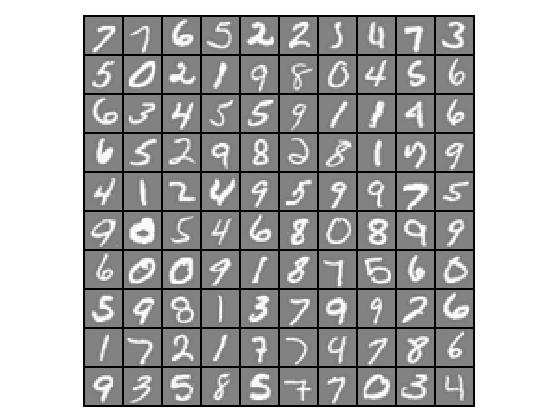
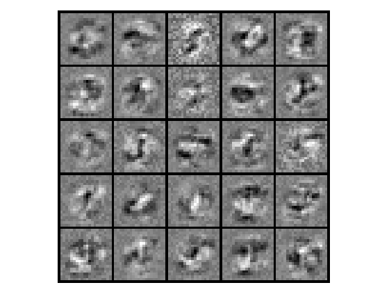

Supervised Learning - Neural Networks Learning - Backpropagation (Octave)
===============================================================================

Note: You can run below code in either Octave or Matlab.

Octave is a free software for mathematics and plotting. You can install Octave from [here](https://www.gnu.org/software/octave/).

Run following commands in Octave, and in the local path where all files are present in local Octave folder. 

`$ octave`

Once in Octave prompt, change the prompt to `>>>` using below command:

`PS1('>>>')`

# Goal 

In the previous section we implemented feedforward propagation for neural networks and used it to predict handwritten digits with the weights already provided. In this section, we will implement the backpropagation algorithm to learn the parameters for the neural network.

# Load Data

We start by first loading and visualizing the dataset.

We will be working with a dataset that contains handwritten digits.

Our  data set in `data.mat` contains 5000 training examples of handwritten digits. The `.mat` format means that the data has been saved in a native Octave/MATLAB matrix format, instead of a text (ASCII) format like a csv-file. These matrices can be read directly into your program by using the load command. After loading, matrices of the correct dimensions and values will appear in your program’s memory. The matrix will already be named, so we do not need to assign names to them.

There are 5000 training examples in `data.mat`, where each training example is a 20x20 pixel grayscale image of the digit. Each pixel is represented by a floating point number indicating the grayscale intensity at that location. The 20x20 grid of pixels is “unrolled” into a 400-dimensional vector. Each of these training examples becomes a single row in our data matrix X. This gives us a 5000x400 matrix X where every row is a training example for a handwritten digit image.

The second part of the training set is a 5000-dimensional vector y that contains labels for the training set. To make things more compatible with Octave/MATLAB indexing, where there is no zero index, we have mapped the digit zero to the value ten. Therefore, a “0” digit is labeled as “10”, while the digits “1” to “9” are labeled as “1” to “9” in their natural order.

## Initialization

Clear all variables 
`>>> clear`

Close all plot windows `>>> close all`

Clear command window/screen `>>> clc`

##  Load Training Data

Training data stored in arrays X, y

`>>> load('data.mat')`

`>>> m = size(X, 1)`

Randomly select 100 data points to display

`>>> rand_indices = randperm(m)`

`>>> sel = X(rand_indices(1:100), :)`

## Display data calling displayData custom function

We will visualize a subset of the training set. We will randomly selects selects 100 rows from X and will pass those rows to the displayData custom function. This function maps each row to a 20x20 pixel grayscale image and displays the images together.

`>>> displayData(sel)`

Note: Octave prompt shoud be in the same path where custom functions (plotData or other custom function we are going to use below) are.

To check the current path run `pwd` in Octave prompt. You can use normal linux commands i.e. `ls` and `cd` to check / change paths. 

## Load trained parameters 

We are going to use network parameters (&Theta;(1), &Theta;(2)) which are already trained by us. These are stored in `weights.mat` and will be loaded into Theta1 and Theta2. The parameters have dimensions that are sized for a neural network with 25 units in the second layer and 10 output units (corresponding to the 10 digit classes).

Load the weights into variables Theta1 and Theta2

`>>> load('weights.mat')`

## Unroll parameters 
`>>> nn_params = [Theta1(:) ; Theta2(:)]`

# Sigmoid Gradient  

Before we start implementing the neural network, we will first implement the gradient for the sigmoid function. 

## Evaluating sigmoid gradient

`>>> g = sigmoidGradient([-1 -0.5 0 0.5 1]);`

Expected value:  `0.19661   0.23500   0.25000   0.23500   0.19661`

# Compute Cost (Feedforward)

We will implement the cost function using feedforward and then use backpropagation to calculate gradient. 

`>>> input_layer_size  = 400;  % 20x20 Input Images of Digits`
`>>> hidden_layer_size = 25;   % 25 hidden units`
`>>> num_labels = 10; % 10 labels, from 1 to 10 (note that we have mapped "0" to label 10)`

### Calculate for &lambda;=0

`>>> lambda = 0;`

`>>> [J grad] = nnCostFunction(nn_params, input_layer_size, hidden_layer_size, num_labels, X, y, lambda);`

Expected value of J: `0.28763`

Expected first 4 values of grad: `0.000061871, 0.000093880, -0.000192594, -0.000168495`

### Calculate for &lambda;=1

`>>> lambda = 1;`

`>>> [J grad] = nnCostFunction(nn_params, input_layer_size, hidden_layer_size, num_labels, X, y, lambda);`

Expected value of J: `0.38377`

Expected first 4 values of grad: `0.000061871, 0.000093880, -0.000192594, -0.000168495`

# Gradient Checking 

##  Check gradients by running checkNNGradients

`>>> checkNNGradients;`

If your backpropagation implementation is correct, then the relative difference will be small (less than 1e-9). 

Expected Relative Difference: `2.33553e-11`

## Check gradients for &lambda;=3

`>>> lambda = 3;`

`>>> checkNNGradients(lambda);`

Expected Relative Difference: `2.25401e-11`

## Also output the costFunction debugging values
`>>> debug_J  = nnCostFunction(nn_params, input_layer_size, hidden_layer_size, num_labels, X, y, lambda);`

Expected value for &lambda;=3: `0.57605`

#  Random initialization: Symmetry breaking

We are going to select random parameters to avoid symmetry.

Initialize each &Theta; to a random value in [- &epsilon;, &epsilon;] i.e. -&epsilon; &le; &Theta; &le; &epsilon;

Call custom function randInitializeWeights to randomly select &theta; for &epsilon;= 0.12

`>>> initial_Theta1 = randInitializeWeights(input_layer_size, hidden_layer_size);`

`>>> initial_Theta2 = randInitializeWeights(hidden_layer_size, num_labels);`

## Unroll parameters
`>>> initial_nn_params = [initial_Theta1(:) ; initial_Theta2(:)];`

# Training Neural Network 

You have now implemented all the code necessary to train a neural network. To train your neural network, we will now use advanced optimizing technique and use "fmincg" funciton, which is a function which works similarly to "fminunc". Note that these advanced optimizers are able to train our cost functions efficiently as long as we provide them with the gradient computations.

Note: For large data set, we train model once and save the parameters &Theta;. We use these saved parameters later for prediction. 

`>>> options = optimset('MaxIter', 50);`

`>>> lambda = 1;`

Create "short hand" for the cost function to be minimized

`>>> costFunction = @(p) nnCostFunction(p, input_layer_size, hidden_layer_size, num_labels, X, y, lambda);`

Now, costFunction is a function that takes in only one argument (the neural network parameters)

`>>> [nn_params, cost] = fmincg(costFunction, initial_nn_params, options);`

Obtain &Theta;1 and &Theta;2 back from nn_params

`>>> Theta1 = reshape(nn_params(1:hidden_layer_size * (input_layer_size + 1)), hidden_layer_size, (input_layer_size + 1));`

`>>> Theta2 = reshape(nn_params((1 + (hidden_layer_size * (input_layer_size + 1))):end), num_labels, (hidden_layer_size + 1));`

Expected first 4 values of &Theta;1: `0.79812  -0.83126  -0.11598  -0.18697`

Expected first 4 values of &Theta;2: `0.054725  -0.995873  -1.104821  -0.693625`

# Visualize Weights (&Theta;)

We can now "visualize" what the neural network is learning by displaying the hidden units to see what features they are capturing in the data.

`>>> displayData(Theta1(:, 2:end));`

# Prediction

After training the neural network, we would like to use it to predict the labels. We will call "predict" custom function to use the neural network to predict the labels of the training set. This lets you compute the training set accuracy. We will use trained &Theta; we used above to predict for data set. 

`>>> pred = predict(Theta1, Theta2, X);`

Get first 4 values of pred:

`>>> pred(1:4,1)`

Expected first 4 values of &Theta;: `10`, `10`, `10`, `10`

# Training Set Accuracy

`>>> fprintf('\nTraining Set Accuracy: %f\n', mean(double(pred == y)) * 100);`

Expected value: `94.900000`

# Test Model 

Call custom function predictImg and pass the  20x20 pixel image. Note that we save this image in previous section. We will use trained &Theta; we used above to predict for data set. 

 
`>>> p = predictImg(Theta1, Theta2, './predict-images/8.png')`

Expected value: `8`

Test for all images `0-9`. Node that for `0`, model will return `10` but we will print `0`.

