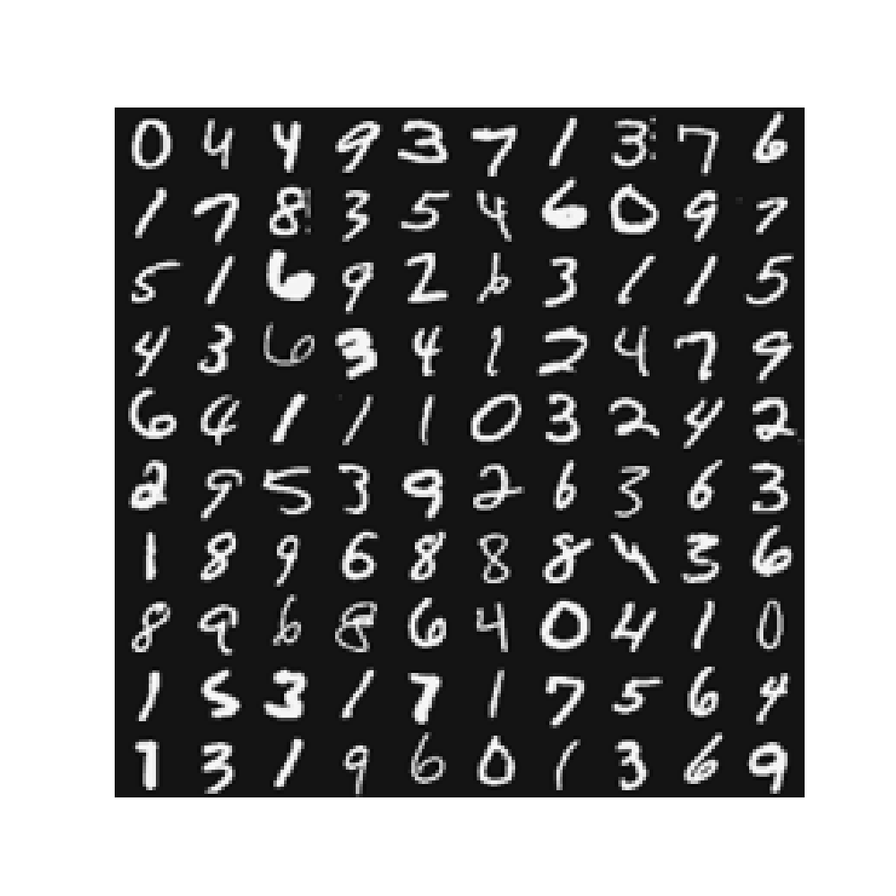
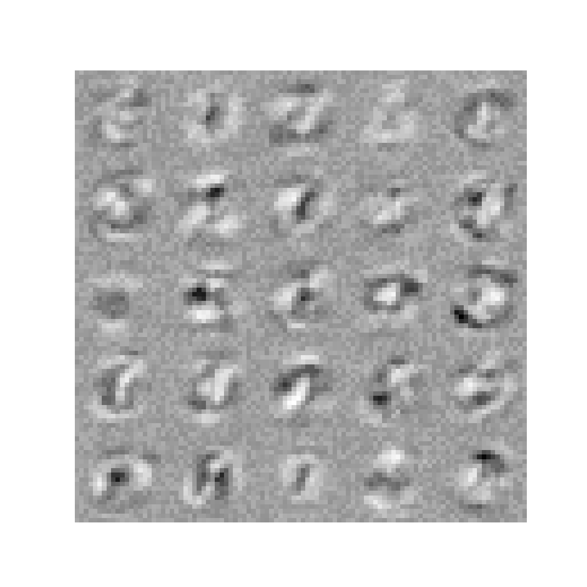

Supervised Learning - Neural Networks Learning - Backpropagation (Python)
===============================================================================

Run following commands in Python3, and in the local path where all files are present in local Python folder. 

You need to install [Matplotlib](https://matplotlib.org/index.html) which we are using for plotting the data. 

To [install](https://matplotlib.org/users/installing.html) Matplotlib on Mac run following command: 

`$ python3 -m pip install -U matplotlib`

# Goal 

In the previous section we implemented feedforward propagation for neural networks and used it to predict handwritten digits with the weights already provided. In this section, we will implement the backpropagation algorithm to learn the parameters for the neural network.

# Load Data

We start by first loading and visualizing the dataset.

We will be working with a dataset that contains handwritten digits.

Our  data set in `data.mat` contains 5000 training examples of handwritten digits. The `.mat` format means that the data has been saved in a native Octave/MATLAB matrix format, instead of a text (ASCII) format like a csv-file. These matrices can be read directly into your program by using the load command. After loading, matrices of the correct dimensions and values will appear in your program’s memory. The matrix will already be named, so we do not need to assign names to them.

There are 5000 training examples in `data.mat`, where each training example is a 20x20 pixel grayscale image of the digit. Each pixel is represented by a floating point number indicating the grayscale intensity at that location. The 20x20 grid of pixels is “unrolled” into a 400-dimensional vector. Each of these training examples becomes a single row in our data matrix X. This gives us a 5000x400 matrix X where every row is a training example for a handwritten digit image.

The second part of the training set is a 5000-dimensional vector y that contains labels for the training set. To make things more compatible with Octave/MATLAB indexing, where there is no zero index, we have mapped the digit zero to the value ten. Therefore, a “0” digit is labeled as “10”, while the digits “1” to “9” are labeled as “1” to “9” in their natural order.

##  Load Training Data

Module `loadData.py` will be used to load data. We will use this module in other python files. 

## Load trained parameters 

We are going to use network parameters (&Theta;(1), &Theta;(2)) which are already trained by us. These are stored in `weights.mat` and will be loaded into Theta1 and Theta2. The parameters have dimensions that are sized for a neural network with 25 units in the second layer and 10 output units (corresponding to the 10 digit classes).

## Display data calling displayData custom function

We will visualize a subset of the training set. We will randomly selects rows from X. This function maps each row to a 20x20 pixel grayscale image and displays the images together.

Run displayData.py from command prompt:

`$ python3 displayData.py`

# Sigmoid Gradient  

Before we start implementing the neural network, we will first implement the gradient for the sigmoid function. 

## Evaluating sigmoid gradient

`$ g = sigmoidGradient([-1 -0.5 0 0.5 1]);`

Expected value: `0.19661193, 0.23500371, 0.25, 0.23500371, 0.19661193`
                

## Unroll parameters

`utility.py` module implements `unrollParameters` function.

# Compute Cost

We will implement the cost function using feedforward and then use backpropagation to calculate gradient. 

Run nnCostFunction.py from command prompt:

`$ python3 nnCostFunction.py`

Script will call the `nnCostFunction` function in `nnCostFunction.py` module:
* Calculate cost for &lambda; values `0` and `1`
* Expected values `0.2876291651613189` (for &lambda;=0), `0.38376985909092365` (for &lambda;=1)
* Calculate gradient by calling `backPropagate` function 
* Expected first 4 values of grad: `0.000061871, 0.000093880, -0.000192594, -0.000168495` 

# Gradient Checking 

If your backpropagation implementation is correct, then the relative difference will be small (less than 1e-9). 

Run checkNNGradients.py from command prompt:

`$ python3 checkNNGradients.py`

Script will call the `checkNNGradients` function in `checkNNGradients.py` module:
* Expected values `2.404414918658002e-11` (for &lambda;=0), `2.2763406298445233e-11` (for &lambda;=3)

#  Random initialization: Symmetry breaking

We are going to select random parameters to avoid symmetry.

Initialize each &Theta; to a random value in [- &epsilon;, &epsilon;] i.e. -&epsilon; &le; &Theta; &le; &epsilon;

`utility.py` module implements `randInitializeWeights` function.

# Training Neural Network 

You have now implemented all the code necessary to train a neural network. To train your neural network, we will now use advanced optimizing technique and use "minimize" funciton, which is a function which works similarly to "fminunc". Note that these advanced optimizers are able to train our cost functions efficiently as long as we provide them with the gradient computations.

`trainNN.py` module implements `trainNN` function. Function will train Neural Network for &lambda;=1 and `200` iterations. We will call this function in prediction. 

`trainNN` function will save trained parameters &Theta; in `trainedTheta.npy` file.

# Visualize Weights (&Theta;)

We can now "visualize" what the neural network is learning by displaying the hidden units to see what features they are capturing in the data.

`trainNN.py` module will display the trained &Theta;. 

# Prediction

After training the neural network, we would like to use it to predict the labels. We will call "predict" custom function to use the neural network to predict the labels of the training set. This lets you compute the training set accuracy.

Run predict.py from command prompt:

`$ python3 predict.py`

Script will call the predict function which will use trained parameters &Theta;, and then will calculate the prediction values:

Expected first 4 values of pred: `10`, `10`, `10`, `10`

# Training Set Accuracy

Run computeAccuracy.py from command prompt:

`$ python3 computeAccuracy.py`

Script will call the computeAccuracy function which will do following:
* Call `predict` function in `predict.py` module and use save parameters &Theta;
* Calculate training set accuracy

Expected value: `99.14`

# Test Model 

Call custom function `predictImg` and pass the  20x20 pixel image. Note that we generated these images in Neural Networks Octave implementation. We will used saved trained parameters &Theta;.
 
 `$ python3 predictImg.py`

Expected value: `8`

Test for all images `0-9`. Node that for `0`, model will return `10` but we will print `0`.

